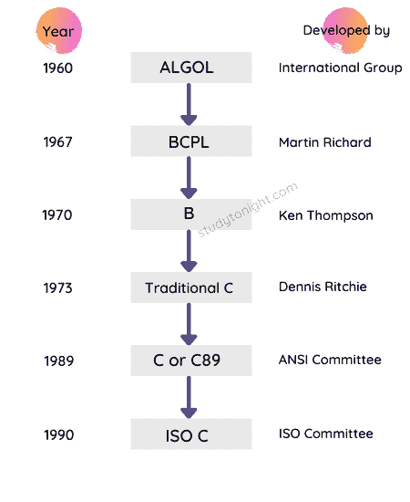

# C 语言概述

> 原文：<https://www.studytonight.com/c/overview-of-c.php>

欢迎来到 C 语言教程系列。这是网上最好的 C 语言教程集，会帮助你学习 C 语言。

c 语言是由丹尼斯·里奇于 1972 年在贝尔实验室开发的。1989 年，C 语言实现了标准化，在这里定义了 C 语言的特性，也称为 C 的 **1989 ANSI 标准**，也就是这个原因，你会看到 C 语言也称为 **C89** ，因为 1989 ANSI 标准。

C 语言的最新版本是 **C99** ，因为在 **1999** 中，一些新的特性被添加到了 C 语言中。

你一定在想，1999 年已经是 20 多年前的事了，但是 **C 语言还是很相关的**和**广泛使用的**虽然还有很多其他的新语言像 C++、Java、Python、C#等。在市场上。

C 语言是一种**中间层**、**结构化编程语言**，以至于**需要一个编译器**来运行用 C 语言编写的程序。不要担心这些术语，我们将在本教程中详细介绍它们。

## C 语言的历史

c 语言已经从三种不同的结构化语言**进化为 ALGOL、BCPL 和 B 语言**。它使用了这些语言中的许多概念，同时引入了许多新概念，如[数据类型](https://www.studytonight.com/c/datatype-in-c.php)、[结构](https://www.studytonight.com/c/structures-in-c.php)、[指针](https://www.studytonight.com/c/pointers-in-c.php)等。

**BCPL** 由**马丁·理查兹**开发，在此基础上 **B 语言**由**肯·汤普森**创建。然后 B 语言就是创造 C 语言的语言。

1989 年，该语言由美国国家标准协会正式确定。

1990 年，C 语言的一个版本被**国际标准组织** (ISO)批准，那个版本的 C 也被称为 **C89** 。

在 C 语言被全世界所接受，全世界的程序员都开始使用它之后，很快，为了进一步改进 C 语言，开发 C++语言的工作开始了。

创造 C 语言背后的**想法是创造一种**简单语言**，它需要一个**简单的编译器**(将代码从英语翻译成计算机能理解的二进制(0 和 1))，并使程序员能够**用接近英语的语言编写复杂的程序**，因为早期的程序员不得不编写非常难记的机器指令。**

C 语言**编译器**将可读的 C 语言代码转换成机器指令。

## C 语言为什么这么受欢迎？

c 语言是向编程世界介绍自己的一种非常好的语言，因为它是一种简单易学的语言，能够创造奇迹。

用 C 语言编写的程序**执行**花费的时间很少，几乎以汇编语言指令的**速度执行。(汇编级指令只不过是与计算机硬件通信的直接命令)**

最初，C 语言主要用于编写系统级程序，如设计操作系统，因为在八十年代(1980-1989 年)，制造一个稳定的、世界公认的操作系统的斗争正在进行。

但是 C 语言也可以用来开发其他应用，比如**文本编辑器、编译器、网络驱动**，很多传统的 PoS(销售点)软件比如**餐厅计费系统**等。

## 最新版本的 C

C 语言目前最新的版本是 **C11** ，是 2018 年**推出的**。所有标准的 C 语言编译器都支持它，但是许多编译器仍然不支持它。

在这个版本中引入了许多新特性，并对提高 C 语言与 C++语言的兼容性进行了全面的尝试。在本教程系列的最后，一旦我们学习完 C 语言，我们将学习 **C11** 版本。

C 语言最广泛使用的**版本**仍然是 **C89** 和 **C99** 。

## 在本教程系列中，我们将学习什么？

在本教程系列中，我们将通过代码示例、简单的解释来涵盖 C 编程语言的所有概念，并在学习时理解各种概念在现实世界中的使用。

除了教程之外，我们还为您提供了丰富的**[【C 程序】](https://www.studytonight.com/c/programs/)****[C 面试 MCQs](https://www.studytonight.com/tests/?subject=c)** ，让您可以并行测试自己的知识。

你也可以试着写 C 程序，在我们的 **[在线 C 编译器](https://www.studytonight.com/code/playground/c/)** 中运行，只要登录开始使用就可以了。

## 常见问题

这里有一些初学者在开始学习 C 语言时经常遇到的问题。

### 1.C 语言是什么？

这是一种计算机编程语言，由肯·汤普森和丹尼斯·里奇在贝尔实验室于 20 世纪 70 年代初开发。

它是一种编程语言，是为操作系统 UNIX 进行系统编程而开发的，但后来被用于开发日常使用的软件和程序。大型科技公司(FAANG 公司)仍在使用它来开发操作系统和创建系统级程序。

### 2.C 语言有什么特点？

c 是最流行的编程语言之一。它有许多特点:

*   **模块化:**允许模块的复用。它有你可以使用的带有现成函数的头文件。

*   **中级语言:**结合了低级语言和高级语言的优点。( [C 数组](https://www.studytonight.com/c/arrays-in-c.php)、 [C 指针](https://www.studytonight.com/c/pointers-in-c.php)等。)

*   **通用编程语言:**可以用来实现任何一种应用，就像 Python 一样。( **[学蟒](https://www.studytonight.com/python/)** )

*   **可移植性:** C 程序可以在任何操作系统(Unix、DOS、Windows)中编译或执行。你可以在 Windows 中编译这个程序，然后在 Unix 机器上运行它，它会毫无问题地运行。

*   **强大的编程语言:**是一种非常高效、强大的编程语言。最好用于[数据结构](https://www.studytonight.com/data-structures/)和设计系统软件。

*   **C 是区分大小写的语言**。

我们已经在下一个教程中列出了 C 语言的所有特性-[C 语言的特性](https://www.studytonight.com/c/features-of-c.php)

### 3.C 语言是用来做什么的？

它是最具可移植性的语言之一，主要用于创建系统应用程序，这些应用程序构成了 Windows、UNIX 和 Linux 操作系统的主要部分。

c 是一种**通用**编程语言。它用于企业应用程序、游戏、图形和需要计算或简单软件的应用程序等。**T3】**

### 4.今天 C 在哪里用？

c 用于开发操作系统和内核级程序。

它用于编译器的生产。我们可以借助 C 语言开发桌面和手机操作系统，例如安卓。

## 结论

本教程是关于 C 语言及其历史的概述。c 是丹尼斯·里奇于 1972 年在美国电话电报公司和贝尔实验室开发的。在下一个教程中，我们将详细了解 C 语言的特性。

* * *

* * *