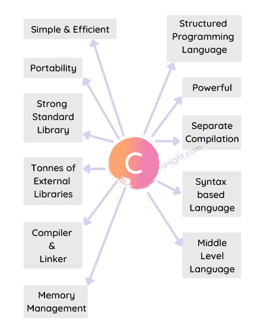

# C 语言的特点

> 原文:[https://www.studytonight.com/c/features-of-c.php](https://www.studytonight.com/c/features-of-c.php)

这里我们列出了 C 语言的所有主要特性，给大家更多学习 C 语言的理由。

C 编程语言是一种功能丰富的编程语言。它具有开发人员(初学者或专家)希望编程语言具有的所有必需特性。

C 语言是从**基础剑桥编程语言(BCPL)** 和 **B 语言**发展而来的。但是它比 BASIC 快很多倍，并且还有更多我们将在本教程中学习的特性。

下面是一个简单的图表，列出了 C 语言的主要特性。

让我们逐一讨论所有这些特性。

### 1.简单高效

C 语言是一种简单的语言，即使对于初学者来说也很容易学习，并且在开发时间和执行时间方面都非常高效。是的，如果你想用 C 语言创建软件，你可以用很少的时间来完成，这取决于你想编码的软件的大小。

### 2.轻便

c 语言程序在任何地方都以同样的方式运行。意思是如果你已经在你的 Windows OS 笔记本电脑或电脑上写了一个简单的 [C 程序](https://www.studytonight.com/c/programs/)像[程序一样在 C](https://www.studytonight.com/c/programs/numbers/sum-of-n-numbers) 中找到 N 个数的和，然后编译运行，那么你就可以拿着编译好的代码在任何其他操作系统或机器上运行，像 Linux 或 macOS 等。，您的 C 程序将总是返回相同的结果。

如果你有用 C 语言编写的用于 Unix 操作系统的软件，而你现在想在 Windows 操作系统上运行它，你可以很容易地将软件适配到 Windows 操作系统上，这就是 C 语言的强大之处。

因此，我们可以说 C 语言是可移植的。

### 3.结构化程序设计语言

C 语言是一种结构化的编程语言，因为我们可以[用 C 语言](https://www.studytonight.com/c/user-defined-functions-in-c.php)创建函数。使用函数，我们可以将特定的操作从主程序中分离出来，然后一次又一次地使用它。

结构化语言不仅仅是具有创建函数的能力，它还支持**循环**、**条件语句**等。所有这些我们将在接下来的教程中详细介绍。

### 4.强大的

c 语言是一种非常强大的编程语言。它具有广泛的特性，如支持许多**数据类型、运算符、关键字等。**，允许使用**函数**、**循环**、**决策语句**来构造代码，然后是复杂的数据结构，如**结构**、**数组**等。，以及**指针**，这使得 C 相当足智多谋和强大等。

使用 C 语言你可以**轻松的读取、写入和创建文件**。这听起来像是今天的一个基本特征，但在 20 世纪 90 年代初，这是一个游戏规则的改变者。

### 5.丰富的标准库

支持各种内置函数和库，可以快速创建开发。对 C 语言的**标准库支持**是极好的，你会看到你在用 C 语言写代码的时候会用到的很多关键词或者现成的操作都已经预定义好了。我们只需要使用它们，而不用担心它们是如何工作的。

这些库在 C 语言中称为**头文件**。

### 6.图书馆支持

不仅仅是 C 语言的标准库，还有一个由世界各地的开发人员/编码人员创建的第三方库组成的**大型生态系统，任何人都可以使用它们。**

甚至你可以编写自己的 C 语言库，并通过你的 Github 配置文件在线分发。你永远不知道，世界各地的人们可能需要你的解决方案。

### 7.单独编译

c 语言代码被编译，然后运行。我们将在另一个教程中学习如何编译 C 语言代码。现在，假设代码已经编译好了。显然，代码的编译需要一些时间。一小部分代码会编译得更快，而大部分代码需要时间来编译。

在 C 语言中，你可以**破解你的代码，并把它放到多个源代码文件**中。c 语言将单独编译这些文件，然后将它们链接在一起执行。

这使得**编译速度快了**。

这样做的另一个好处是，**多个程序员/开发人员**可以在处理单个项目的同时处理不同的代码文件。

### 8.中级语言

C 编程语言集两者之长。

一种**低级语言**一般速度快，功能强大，但是很难理解和编写代码。虽然**高级语言**对我们来说很容易理解和编写代码，但是它也是高度可移植的，但是它通常很慢，并且不能直接与系统硬件对话。

因此，C 编程语言被称为**中级**编程语言，允许对位、字节和地址进行操作，因此提供了对计算机系统的低级访问，同时易于使用、可移植，并支持高级语言的所有其他特性等。

### 9.基于语法的语言

像大多数高级语言一样，例如 Java、C++、C#， **C 语言有语法**，有**适当的规则写代码**，C 语言严格遵循。

如果您编写了任何不允许的内容，您将会得到一个编译时错误，当编译器因为一些不正确的代码语法而无法编译您的代码时，就会发生这种情况。

### 10.格式化自由语言

C 语言是一种无格式语言。C 语言代码中不需要行号，或者我们可以说行号没有任何意义。没有必要将语句放在一行的指定位置。

### 11.编译语言

C 语言使用编译器将代码编译成**目标代码**，这不过是计算机理解的**机器码**。因此，要运行一个 C 语言程序，我们必须先安装一个 C 语言编译器。

### 12.区分大小写的语言

在 C 语言中，大小写字母是不同的。也就是说`if`和 C 语言中的`IF`不一样。

* * *

## 常见问题解答

这里有一些常见的问题，初学者在学习 C 语言的特性时会遇到。

### 1.C 语言的主要特点是什么？

C 语言的主要特点是，**简单(易学)但功能强大**、**可移植**、**中级语言**，是**结构化**，需要一个**编译器**来执行。C 语言还有一个丰富的标准库**，支持的是**广泛的第三方库**。**

 **### 2.C 语言流行背后的主要原因是什么？

C 语言流行背后的主要原因是它拥有丰富的特性集，使其成为一种适合广泛用例的语言。您可以使用 C 语言或任何其他简单的软件来创建操作系统。C 语言是一种通用编程语言。

### 3.为什么 C 被认为是一种强大的编程语言？

它被认为是一种强大的语言，因为它提供了广泛的功能，如支持许多**数据类型、运算符、关键字等。**，允许使用**函数**、**循环**、**决策语句**来构造代码，然后是复杂的数据结构，如**结构**、**数组**等。，以及**指针**，这使得 C 相当足智多谋和强大等。

### 4.C 语言可移植吗？

是的，C 语言代码是**便携**。如果你有用 C 语言编写的用于 Unix 操作系统的软件，而你现在想在 Windows 操作系统上运行它，你可以很容易地将软件适配到 Windows 操作系统上，这就是 C 语言的强大之处。

### 5.C 语言有什么优势？

下面给出了 C 语言的一些优点:

C 是一种可移植的语言。

b)提供丰富的内置功能支持。

c)它是一种强大而高效的语言。

C 语言是一种结构化语言，具有高级语言和低级语言的特点。

* * *

## 结论

在本教程中，我们介绍了 C 语言的特性，用一个例子解释了每个特性，以便您理解每个特性的含义。不要只学习 C 语言的特性，而是要努力理解这些特性的含义。

* * *

* * ***