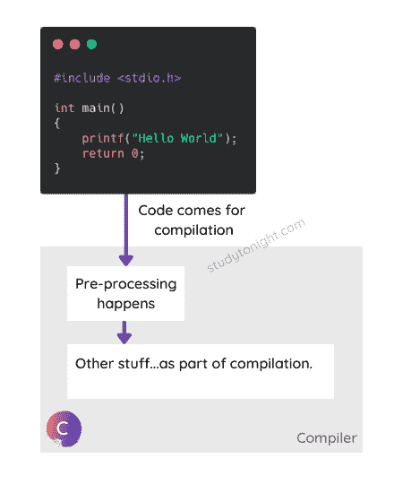
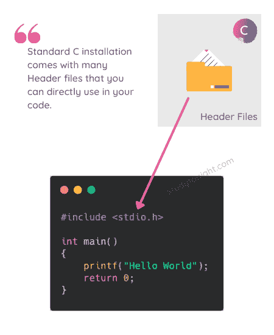

# 第一个 C 程序及其结构

> 原文:[https://www.studytonight.com/c/first-c-program.php](https://www.studytonight.com/c/first-c-program.php)

在本教程中，我们将学习创建第一个 C 程序，然后了解它的结构。首先来看看如何用 C 语言编写一个**简单的**和**最基础的 Hello World 程序**。我们开始吧。

这是用 C 语言打印“你好世界”的程序。

```cpp
#include <stdio.h>

int main()
{
    printf("Hello World");
    return 0;
}
```

你好，世界

[运行代码→](https://www.studytonight.com/code/playground/c/?id=kB7XiP)

要在本地计算机上运行上述代码，您必须在计算机/笔记本电脑上安装一个 C 语言编译器。我们将在下一个教程中学习如何做到这一点- [编译并运行 C 代码](https://www.studytonight.com/c/compile-and-run-c-program.php)。

如果你不想在你的计算机上安装 C 编译器，不要担心。你可以使用我们的**在线编译器**运行 C 程序并练习。点击上面的**运行程序按钮**打开编译器。

## 理解 C 程序的结构

下面给出了 C 程序的一些不同部分:

*   预处理器

*   头文件

*   main() [功能](https://www.studytonight.com/c/user-defined-functions-in-c.php)

*   [C 中的变量](https://www.studytonight.com/c/variables-in-c.php)

*   [语句&C 中的表达式](https://www.studytonight.com/c/decision-making-in-c.php)

所有这些都是 C 语言程序必不可少的部分。不要担心这一切，我们会一件一件地了解一切，也会清除你所有的困惑。

让我们从介绍我们在上面的 Hello World 程序中使用的各种代码语句开始。

### 1.预处理器

`#include`是任何 C 程序的第一个语句。它被称为**预处理器**。预处理器的任务是初始化程序的环境，即把程序和所需的头文件联系起来。

顾名思义，这一行代码是**负责做预处理**，在实际代码(逻辑)执行之前。



所以，当我们说`#include<stdio.h>`的时候，是通知编译器在执行程序之前把 **stdio.h** 头文件也就是**标准 I/O 库**包含到程序中。

**标准 I/O 库**让你从键盘读取输入(即标准输入)，然后将输出写入控制台屏幕(即标准输出)，这是一个非常有用的库。

这里所说的**控制台屏幕，**是指 Windows 操作系统下的 **CMD** 或命令提示符，使用 Linux/Ubuntu/macOS 下的**终端**。

同样，我们可以包含任意数量的头文件。

`#include`不是唯一的预处理器。每当你看到任何一段以`#`符号开头的代码，这意味着它是一个 C 语言的预处理器。稍后我们将详细了解预处理器。

### 2.头文件

一个**头文件**是一组**内置(现成)功能的集合**，我们可以在程序中直接使用。

头文件包含函数的**定义，可以通过使用预处理器`#include`语句和头文件的名称在任何 C 程序中使用。**

有一些标准的头文件伴随着默认的 C 安装，比如 **stdio.h** 头文件。还有很多其他这样的文件，我们稍后会了解它们。

随着时间的推移，你会对头文件有一个清晰的了解，现在把它们看作是 C 语言打包的现成函数集合，你可以使用它们而不用担心它们是如何工作的，你所要做的就是把头文件包含在你的程序中。



要使用任何标准库函数，必须包含适当的头文件。这是在 C 源代码的开头完成的。

例如，在 C 程序中使用`printf()`函数，该函数用于**在控制台屏幕上显示任何东西**，则需要行`#include <stdio.h>`，因为头文件 **stdio.h** 包含`printf()`函数定义。

所有头文件都会有**。h** 分机。

### 3.`main()`功能

`main()`功能是每个 C 程序都必须有的功能**。**

C 程序中该函数内部的所有内容都将被执行，因此实际的逻辑或代码总是写在`main()`函数内部。

顾名思义，这是主(*的首要或吸引中心*)功能。

```cpp
#include <stdio.h>

int main()
{
    printf("Hello World");
    return 0;
}
```

在上面的 Hello World 代码示例中，`main()`函数之前写了`int`，还记得吗？嗯，这就是`main()`功能的**返回类型**。我们稍后将详细讨论它。

`main()`函数后面的花括号`{ }`包含了`main()`函数的**体**。

我们将在即将到来的教程中学习 C 语言中的[函数是什么。](https://www.studytonight.com/c/user-defined-functions-in-c.php)

### 4.`printf()`功能

`printf()`是一个用于在控制台上打印(显示)任何内容作为输出的功能。这个函数是在 **stdio.h** 头文件中定义的，我们已经把它包含在我们的 C 程序中了。

我们将在下一个教程中介绍如何获取输入和显示输出。

### 5.返回语句

`return`语句用于返回对调用者函数的响应。它通常是任何 C 语言函数的最后一条语句。不要担心这一点，当我们学习 C 语言中的函数时，我们将讨论这一陈述。

### 6.分号

需要注意的是，C 中的每个语句都应该以**分号(；)**。如果您错过添加任何分号，编译器将给出一个错误。

## 如何在我的电脑上写 C 程序？

所有的 C 程序都可以在**记事本**或**记事本++** 等普通文本编辑器中编写和编辑，必须用文件名和**保存。c** 延长。例如， **helloworld.c** 可以是 helloworld 程序的文件名。

如果不添加扩展名**。c** 那么编译器不会将其识别为 C 语言程序文件。

* * *

## 常见问题解答

### 1.说出 C 语言编程中不同的预处理程序？

C 语言中不同的预处理程序有`#include`、`#if`、`#define`、`#ifdef`、`#undef`等。还有更多。预处理器是在执行 C 程序的主代码之前执行的语句。

### 2.C 语言中的 main()函数能理解什么？

C 语言中的`main()`函数充当任何程序的入口点，或者我们可以说代码的执行从这里开始。执行`main()`函数内部的源代码。

### 3.如何给 C 程序添加注释？

要添加单行注释，可以在注释后面使用斜线`**//**`，对于多行注释，可以使用如下: **/*此处注释*/** 。

### 4.C 程序中的 stdio.h 是什么？

**stdio** 代表**标准输入输出**和**。h** 是文件的扩展名，表示是**头文件**。

这个头文件的主要用途是，它有助于从用户(键盘)获得输入，并将输出结果文本返回给监视器(屏幕)。这个头文件中有我们可以在程序中使用的现成函数，例如`printf()`和`scanf()`函数在 **stdio.h** 头文件中定义。

* * *

## 结论

在本教程中，我们看到了一个简单的 C 语言 Hello World 程序，并介绍了它的结构。在下一个教程中，我们将在本地计算机/笔记本电脑上设置 C 编译器，这样您也可以在您的计算机上运行该程序。

* * *

* * *