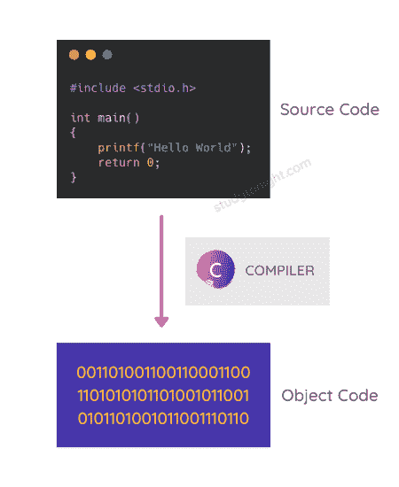
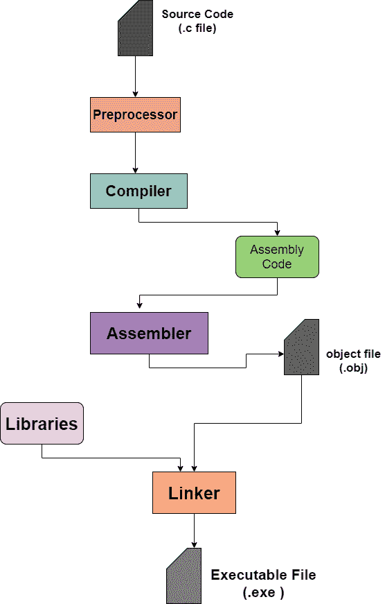

# c 源代码编译过程

> 原文：<https://www.studytonight.com/c/c-compilation-process.php>

C 源代码编译过程是一个多步骤的过程，涉及到**预处理**、**编译代码**、**链接库**等。在本教程中，我们将学习如何将 C 代码编译成目标代码。

将任何**编程语言**(一般为中级或高级语言)编写的源代码转换为计算机可理解的**机器级语言**的过程称为**编译**。用于该转换的软件被称为**编译器**。

在 C 语言中，通过编译，将 C 语言**源代码**转换为**目标代码**。

编译器取**输入**为**源代码**，以**目标代码**的形式提供**输出**。C 语言的完整编译过程进一步分为四个阶段:

1.  **预处理**，

2.  **编译**，

3.  **组装**，以及

4.  **链接**

编译器检查源代码中是否有任何**语法**或**结构错误**，检查后，如果发现源代码没有错误，则生成扩展名为**的目标代码。obj** (适用于车窗)或**。o** (适用于 Linux)。

现在让我们看看 C 语言编译过程的不同阶段。

## 编译过程

如上所述，编译过程的不同阶段如下:

*   预处理

*   收集

*   装配

*   连接

在下面的流程图中，我们已经解释了编译过程是如何工作的，以及编译 C 语言源代码的不同阶段是什么。

让我们按照执行的顺序来讨论 C 语言源代码编译的所有这些阶段。

## 步骤 0:源文件的预处理

在这个阶段，源文件的预处理完成。**预处理器**是接受 C 源代码文件，然后执行以下任务的程序:

*   它将从源代码中删除注释。

*   如果使用了任何宏，它将执行**宏扩展**(不用担心宏，我们稍后会了解它们)

*   它将执行包含的头文件的扩展。

## 第一步:预处理器

它是一个在将源程序传递给编译器之前对其进行处理的程序。在这一步，任何 C 程序中使用的预处理程序都将被处理，源代码也准备好进行编译。

*   每个预处理语句必须以`#`开始，其中 **`#`** 被称为**预处理器指令**。

*   每个预处理指令都是单行代码语句。

*   `#`后的单词叫做**预处理器命令**。

一些预处理器指令如下:

**1。#包括**

使用头文件的名称在 C 语言程序代码中包含特定的头文件。

**2。#定义**

这用于在 C 语言中定义一个宏。

**3。#错误**

这个预处理器命令用于打印错误信息。

就像上面三个一样，还有很多其他的预处理程序，我们将在单独的教程中详细介绍它们。

因此，预处理器扩展源代码(添加所需的信息)，然后将扩展的源代码传递给编译器。

它给出了(**)。一、**)扩展到最初带有(**)的**源代码文件**。c** )延伸。

## 第二步:编译器

预处理器扩展的代码然后被传递给编译器。众所周知，编译器是将**高级语言**(或**中级语言**)代码转换成**汇编代码**的程序，再转换成机器能理解的机器码。

因此，预处理器给编译器的预处理代码然后被编译器转换成汇编代码，然后被传递给**汇编器**。

获取了(**)的源文件。i** )上一步的扩展转换为(**)。s** )由编译器扩展。

## 第三步:汇编程序

汇编器将从编译器获得的汇编代码转换成**目标代码**。该步骤中文件的扩展名变为(**)。obj** )。

不要认为汇编程序是生成目标代码的独立程序。汇编程序是 C 语言源代码编译过程的一部分。

当在外行语言中，我们说，C 代码被编译时，它意味着涵盖所有这些步骤的完整编译过程已经完成。

## 步骤 4:链接器

链接器是一种工具，用于将程序的所有部分按执行顺序链接在一起。该阶段后的代码成为**可执行机器码**。

在某些情况下，我们的程序可能会引用其他文件中定义的函数。或者，如果某个程序的代码太大，我们可以将它分成两个文件，分别编译，然后使用 Linker 链接。

在 C 语言编译过程中，链接器起着非常重要的作用。

如果你的 C 程序包含一个**头文件**，并且你正在使用该头文件中定义的一些函数，那么链接器将**将库内函数所需的目标代码**链接到你的程序的**目标代码**并将它们打包在一起。

同样，如果您的程序代码太大，并且您将其分成两个文件，那么这两个源代码文件将分别转换为目标代码，然后链接器将链接它们，并使代码准备好执行。这也叫**单独编译**。

* * *

## 常见问题

以下是一些与 C 语言编译过程相关的常见问题。

### Q1。你对编译器这个术语有什么理解？

它是一种计算机程序，用于将高级编程语言或中级编程语言的源代码翻译成机器代码，机器代码可以执行，机器可以理解该做什么。

### Q2。什么是预处理器？

预处理器是一个指令，用于指示编译器在实际编译开始之前对源代码进行预处理。C 语言程序的某些部分可以使用预处理器来指定，预处理器只不过是要在编译开始时执行的语句。

### Q3。的另一个名字是什么？c 文件？

扩展名为**的 C 语言代码文件。c** 也被称为**源代码文件**。

### Q4。链接器的作用是什么？

链接器用于将程序的所有部分链接在一起，以便执行。

如果你的 C 程序包含一个**头文件**，并且你正在使用该头文件中定义的一些函数，那么链接器将**将库内函数所需的目标代码**链接到你的程序的**目标代码**并将它们打包在一起。

同样，如果您的程序代码太大，并且您将其分成两个文件，那么这两个源代码文件将分别转换为目标代码，然后链接器将链接它们，并使代码准备好执行。这也叫**单独编译**。

### Q5。C 语言的编译步骤有哪些？

以下是用 C 语言编译的步骤:

1.  预处理器(预处理)

2.  编译器(编译)

3.  汇编程序

4.  链接器(链接)

* * *

## 结论

在本教程中，我们学习了如何编译我们将在即将到来的教程中编写的 C 语言代码。编译中遵循的各种步骤是什么，在这些步骤中会发生什么？

如果你在这之后感到困惑，不要担心，只要阅读它，当我们继续学习教程时，你就会明白一切。

* * *

* * *