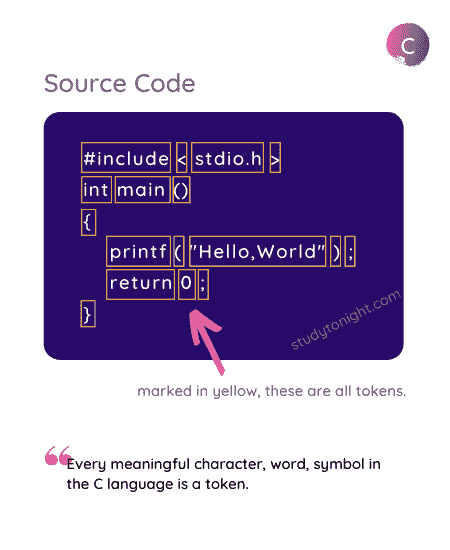
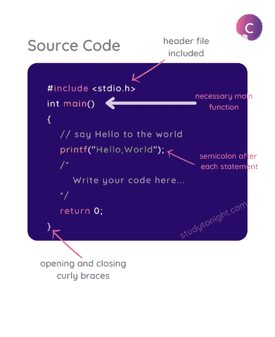

# C 语言基本语法规则

> 原文：<https://www.studytonight.com/c/c-syntax.php>

C 语言语法指定了用 C 语言编写代码的规则。简而言之，这些规则告知如何在 C 语言程序中形成语句——代码行应该如何开始，它应该如何结束，在哪里使用双引号，在哪里使用花括号，在哪里使用括号，等等。

## 什么是语法？

任何语言，无论是英语、印地语还是西班牙语，都有一个**语法**，定义了**使用语言**的规则，例如*如何组成句子*，不同的*单词意味着什么*等等。

在正常的口语或计算机编程语言中，语法意味着如何排列单词、字符、特殊字符，以做出有意义的陈述或表达等。

如果有人说程序中有一个**语法错误**，意味着您没有正确编写程序，您可能在为程序键入代码时遗漏了一些分号或其他一些一般性错误。

有一个**语法错误**并不意味着你的代码逻辑不正确，它意味着你写错了。一旦**语法正确**，那么只编译**代码，然后运行**。

## 代币

C 程序中最小的单个单元被称为 **C Token** 。令牌可以是 **[关键字或标识符](https://www.studytonight.com/c/keywords-and-identifier.php)** 、**常量**、 **[变量](https://www.studytonight.com/c/variables-in-c.php)** ，或任何其他在 C 语言中有某种意义的符号。C 程序也可以称为各种代币的**集合**。

因此，C 语言的语法定义了在编写 C 语言代码时如何一起使用这些标记。

让我们举个例子，

```cpp
#include <stdio.h>
int main()
{
    printf("Hello,World");
    return 0;
}
```

在上面的代码中，如果我们采用`printf`语句:

```cpp
printf("Hello,World");
```

那么本声明中的代币为:`printf`、`(`、`"Hello,World"`、`)`和`;`。

所以 C 令牌基本上是 C 程序的构建模块。

下图显示了整个 Hello World 程序中的 token。



现在让我们看看一些重要的语法规则，在用 C 语言编写代码时，您必须始终记住这些规则。

## 语句以分号(`;`)结束

分号 **`;`** 在 C 语言中用来标记一个语句的结束和另一个语句的开始。

任何语句末尾没有分号，都会误导编译器认为该语句尚未完成，会在其后添加下一个连续语句，可能导致**编译(语法)错误**。

```cpp
#include <stdio.h>
int main()
{
    printf("Hello,World")
    return 0;
}
```

错误:应为“；”在‘返回’
之前返回 0；
^
命令终止，退出代码为 1

在上面的程序中，我们省略了`printf("...")`语句中的分号，因此编译器会认为从`printf`开始直到`return 0`语句之后的分号都是一条语句，这将导致编译错误。

## 向代码添加注释

注释是 C 程序中简单的纯文本，在编译过程中不进行编译。

我们可以在程序中写注释，来解释程序的各个部分。虽然写评论不是强制性的，但是建议让你的程序更有描述性，也更容易被别人理解。

添加注释使代码更易读。

有**两种方式**我们可以写评论。

1.  使用 **`//`** :这是用来写一个**单行评论**。

2.  使用 **`/* */`** :任何包含在`/*`和`*/`中的内容，将被视为**多行注释**。

您甚至可以使用这两种技术注释掉代码，并且该语句或部分代码不会被编译和执行。

### C 语言注释示例:

这里有一个简单的程序来展示如何使用注释:

```cpp
/* 
    This is my first program.
    I am very excited!
*/

#include <stdio.h>
int main()
{
    // Printing Hello World
    printf("Hello,World");
    // printf("Useless piece of code.");
    return 0;
}
```

从上面的代码中可以看到，我们添加了注释，并且还注释了一个`printf()`语句，这个语句不会被执行。

## C 语言的更多语法规则

这只是一个开始，因为我们将在 C 语言中学习更多的概念，我们将学习使用它们的语法以及例子。

在编写代码时，任何东西都有一种编写和使用的方式，这就是它的语法。

*   C 是一种**区分大小写的语言**，所以所有的 C 指令都必须用小写字母写。**主**和**主**不一样。

*   所有 C 语句必须以**分号**结束。

*   **空格**在 C 中用于添加空格和制表符。

*   您不必担心代码的缩进。

*   当我们编写一个函数时，它的主体被包含在**花括号**中，就像对于`main()`函数一样。我们将在讨论函数时详细了解这一点。

下图展示了 C 程序的结构。



* * *

## 常见问题解答

以下是一些与 C 语言语法相关的常见问题。

### Q1。用 C 语言的代币能理解什么？

C 程序中最小的单个单元被称为 **C Token** 。令牌可以是 **[关键字或标识符](https://www.studytonight.com/c/keywords-and-identifier.php)** 、**常量**、 **[变量](https://www.studytonight.com/c/variables-in-c.php)** ，或任何其他在 C 语言中有某种意义的符号。C 程序也可以称为各种代币的**集合**。

### Q2。如果我们忘记在 C 语言的语句末尾使用分号，会发生什么？

如果我们忘记在 C 语言的任何**语句**的末尾放置**分号，那么它将导致语法错误。在这种情况下，编译器会发出一条错误消息，指出**应为分号**。**

### Q3。什么是编译错误？

编译错误或编译时错误是指如果 C 程序的语法不正确，编译器返回的错误。当你试图编译一个有语法错误的程序时，编译器会给出一个错误，这被称为**编译时错误**。

### Q4。如何在 C 语言中添加注释？

我们可以在注释文本的开头使用`//`来添加单行注释，在 C 程序中将文本包含在`/*`和`*/`中来添加多行注释。

### Q5。C 语言中没有`main()`功能的程序能运行吗？

在 C 语言中，`main()`函数定义了执行的起点。如果一个 C 程序没有`main()`函数，那么该程序中不会执行任何代码语句。在大多数情况下，如果编译器找不到`main()`函数，它会给出一个错误。

* * *

## 结论

本教程是关于 C 语言的基本语法规则。我们已经讨论了分号的重要性，C 语言中的标记，以及如何用 C 语言编写单行和多行注释。

* * *

* * *