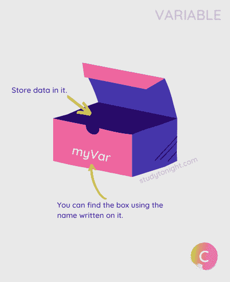
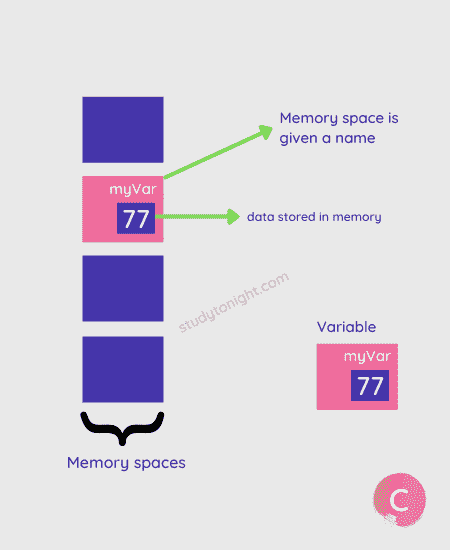
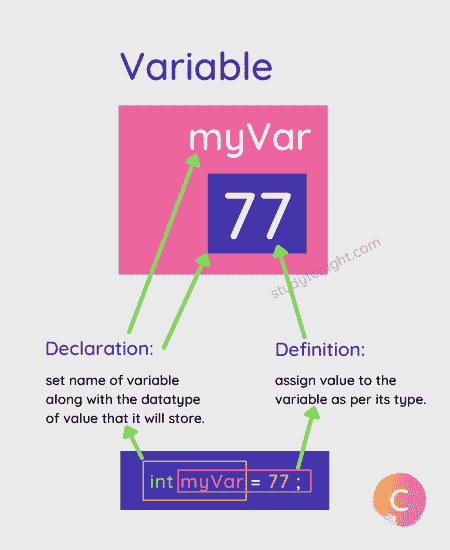

# 变量示例

> 原文：<https://www.studytonight.com/c/variables-in-c.php>

在本教程中，我们将学习什么是**变量**，如何在 C 语言中**声明和定义变量**，以及在 C 语言中什么是**常量和字面值**。

变量就像一个容器(存储空间)，它有一个名称，您可以在其中存储数据。



就像**你家有地址**(门牌号/公寓号)，所以无论什么时候你在网上点东西，只要提供你家地址，送货主管就能找到。

在 C 语言中，如果我们想在我们的程序中使用一些**数据值，该怎么做呢？这是用变量完成的。**

当我们在 C 程序中创建一个变量时，C 编译器根据变量的数据类型分配一个存储空间(8 位用于`char`，16/32 位用于`int`等)。)，然后该存储空间被赋予一个名称，即**变量名**。



一旦创建了一个变量，我们就可以在其中存储值。我们可以根据需要多次更改变量中存储的值，但是我们应该确保存储正确的数据类型值。

## 使用变量的语法:

下面是如何在 C 语言中**创建或声明**一个新的变量，

```cpp
data_type var_name;
```

其中，**数据类型**是一个**有效数据类型**(如果需要的话，还有[数据类型修饰符](https://www.studytonight.com/c/datatype-in-c.php)),而 **var_name** 是变量的**名称。**

例如，

```cpp
int marks;
```

这里，`marks`是变量的名称，可以存储`int`类型的值。

一旦我们声明或创建了变量，我们就可以给它赋值。这叫做**变量定义**。

```cpp
// variable declaration
int marks;
// variable definition
marks = 10;
```

我们也可以在一个步骤中完成**的声明和定义，就像这样(推荐)。**

```cpp
int marks = 10;
```



您可以随时**更改变量**的值。但是要确保**值是正确的数据类型**。

```cpp
// variable defined
int marks = 10;
// assign a new value
marks = 33;
```

## 变量的数据类型

C 语言中的一个**变量**必须给定一个类型，这个类型定义了变量中可以存储什么类型的数据。如果不提供任何数据类型，那么 C 编译器会给出**编译时**错误或语法错误。

数据类型可以是`char`、`int`、`float`、`double`或`short`、`int`、`long`、`int`等。数据类型以及修饰符。

可以了解 **[C 数据类型](https://www.studytonight.com/c/datatype-in-c.php)** 查看 C 语言支持的各种数据类型列表。

让我们举个例子，

```cpp
// char type variable
char status = 'Y';

// int type variable
int marks = 95;

// float type variable
float percentage = 94.6;

// double type variable
double long = 76.997429;
```

如果你试图给一个变量分配一个不正确的数据类型值**，那么编译器可能会给出错误，或者它会自动**将该值转换成变量**的数据类型。**

 **例如，

```cpp
#include <stdio.h>

int main() {
   // assign incorrect value
   int x = 10.58;
   printf("Value is %d", x);
   return 0;
}
```

值为 10

[运行代码→](https://www.studytonight.com/code/playground/c/?id=HPlEdX)

正如您在输出中看到的，C 编译器**删除了小数**之后的部分，因为`int`数据类型只能存储整数。

我们将在下一个教程中学习`printf()`函数和`%d`(用于打印`int`数据类型的值)，并提供更多的代码示例。

### 不能更改数据类型

一旦我们用某种数据类型定义了一个变量，那么我们就不能改变该变量的数据类型。

例如，

```cpp
// int variable
int marks = 10;

float marks;    // error 
```

## 命名变量的规则

当您创建一个变量时，您应该总是给这个变量一个有意义的名称。并遵循以下规则命名变量:

1.  变量名不能以数字开头。

2.  变量名可以由字母、数字和特殊符号组成，如下划线`_`。

3.  变量名中不允许有空格。

4.  [关键字](https://www.studytonight.com/c/keywords-and-identifier.php)不允许作为变量名。

5.  大小写名称视为不同，因为 **C 区分大小写**，建议变量名保留小写。

根据上面的规则，让我们看几个错误名称的例子:

```cpp
int 1var;    // incorrect - should not start with number
int var1;    // correct

int my$var    // incorrect - special characters not allowed
int my_var1;    // correct

int my var;    // incorrect - spaces not allowed

char else;    // can't use Keywords

int count;    // valid variable name
int Count;    // new variable
int COUNT;    // new variable
```

## 创建变量-幕后

**变量的声明**必须在程序中使用之前完成。声明做了以下事情。

1.  它告诉编译器变量名是什么。

2.  它指定变量将保存什么类型的数据。

3.  在定义变量之前，编译器不必担心给变量分配内存空间。

4.  该声明更像是通知编译器程序中使用了具有以下数据类型的变量。

5.  我们甚至可以在`main()`函数之外声明一个变量，使用`extern`关键字。

```cpp
extern int a;
extern float b;
extern double c, d;
```

**定义**或**初始化**一个变量意味着编译器现在必须为该变量分配存储空间，因为它将在程序中使用。

我们甚至可以通过使用逗号将同一数据类型的多个变量分开，在一行中声明它们。

例如，

```cpp
int a;
float b, c;
```

**初始化**一个变量意味着给它提供一个值。

```cpp
int a = 10;
```

## 变量和标识符的区别？

标识符是编程语言中任何变量、函数、结构、指针或任何其他实体的名称。正如我们在本教程中刚刚学到的，变量是一个命名的内存位置，用于存储程序中使用的数据。

| 标识符 | 可变的 |
| 标识符是赋予变量、函数等的**名称。** | 而变量用于命名存储数据的内存位置。 |
| 标识符可以是变量，但不是所有的标识符都是变量。 | 所有变量名都是标识符。 |
| 示例:

```cpp
// studytonight is identifier for a variable
int studytonight;

// studytonight is identifier for a function
int studytonight() { 
    ... 
}
```

 | 示例:

```cpp
// int variable
int a;
// float variable
float a;
```

 |

理解标识符和变量之间区别的另一个很好的类比是:

你可以认为标识符`int x`是一个变量的名称，但是它也可以是一个函数的名称`int x() { }`，并且仍然是一个标识符。

就像**奥巴马**是一个人的名字，也是一个基金会的名字。

## 结论

在本教程中，我们学习了 C 变量，如何创建变量，给变量赋值，以及创建变量后会发生什么。我们还了解了创建新变量时数据类型的重要性。

* * *

* * ***