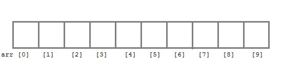
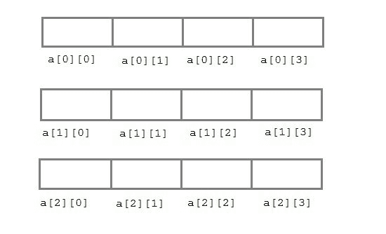

# C 语言中的数组

> 原文：<https://www.studytonight.com/c/arrays-in-c.php>

在 C 语言中，`arrays`被引用为结构化的[数据类型](datatype-in-c.php)。数组被定义为存储在连续存储单元中的同质数据的**有限有序集合。**

这里的话，

*   **有限** *意味着*数据范围必须定义。
*   **有序** *意味着*数据必须存储在连续的内存地址中。
*   **同质** *意味着*数据必须是相似的数据类型。

### 使用数组的例子，

*   要存储员工或学生姓名列表，
*   存储学生的分数，
*   或者存储数字或字符列表等。

由于数组提供了一种简单的表示数据的方式，因此它被归入 C 语言中的[数据结构](introduction-to-data-structures.php)中。C 语言中的其他数据结构有**结构**、**列表**、**队列**、**树**等。数组不仅可以用来表示简单的数据列表，还可以用来表示二维或三维的数据表。

* * *

### 声明数组

像任何其他变量一样，数组必须在使用前声明。数组声明的一般形式是，

```cpp
data-type variable-name[size];

/* Example of array declaration */

int arr[10];
```



这里`int`是数据类型，`arr`是数组的名称，10 是数组的大小。意思是数组`arr`只能包含 10 个`int`类型的元素。

**数组的索引**从`0`开始到**大小-1** ，即`arr`数组的第一个元素将存储在`arr[0]`地址，最后一个元素将占用`arr[9]`。

* * *

### 数组的初始化

声明数组后，必须对其进行初始化。否则将包含**垃圾**值(任意随机值)。数组可以在**编译时**或**运行时**初始化。

#### 编译时数组初始化

数组元素的编译时初始化与普通变量初始化相同。数组初始化的一般形式是，

```cpp
data-type array-name[size] = { list of values };

/* Here are a few examples */
int marks[4]={ 67, 87, 56, 77 };    // integer array initialization

float area[5]={ 23.4, 6.8, 5.5 };   // float array initialization

int marks[4]={ 67, 87, 56, 77, 59 };    // Compile time error
```

需要记住的一件重要的事情是，当你给出的初始值设定项(数组元素)比声明的数组大时，编译器会给出一个错误。

```cpp
#include<stdio.h>

void main()
{
    int i;
    int arr[] = {2, 3, 4};      // Compile time array initialization
    for(i = 0 ; i < 3 ; i++) 
    {
        printf("%d\t",arr[i]);
    }
}
```

2 3 4

#### 运行时数组初始化

也可以在运行时使用`scanf()`函数初始化数组。这种方法通常用于初始化大型数组，或者用用户指定的值初始化数组。例如，

```cpp
#include<stdio.h>

void main()
{
    int arr[4];
    int i, j;
    printf("Enter array element");
    for(i = 0; i < 4; i++)
    {
        scanf("%d", &arr[i]);    //Run time array initialization
    }
    for(j = 0; j < 4; j++)
    {
        printf("%d\n", arr[j]);
    }
}
```

* * *

### 二维数组

C 语言也支持多维数组。多维数组最简单的形式是二维数组。行和列的索引都从`0`开始。

二维数组声明如下:

```cpp
data-type array-name[row-size][column-size] 

/* Example */
int a[3][4];
```



数组也可以一起声明和初始化。例如，

```cpp
int arr[][3] = {
    {0,0,0},
    {1,1,1}
};
```

**注意:**在上面的示例中，我们没有为数组分配任何行值。这意味着我们可以初始化任意数量的行。但是，我们必须始终指定列数，否则会产生编译时错误。这里，创建了一个`2*3`多维矩阵。

#### 二维数组的运行时初始化

```cpp
#include<stdio.h>

void main()
{
    int arr[3][4];
    int i, j, k;
    printf("Enter array element");
    for(i = 0; i < 3;i++)
    {
        for(j = 0; j < 4; j++)
        {
            scanf("%d", &arr[i][j]);
        }
    }
    for(i = 0; i < 3; i++)
    {
        for(j = 0; j < 4; j++)
        {
            printf("%d", arr[i][j]);
        }
    }
}
```

* * *

* * *