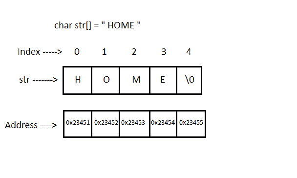
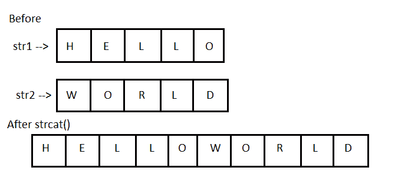
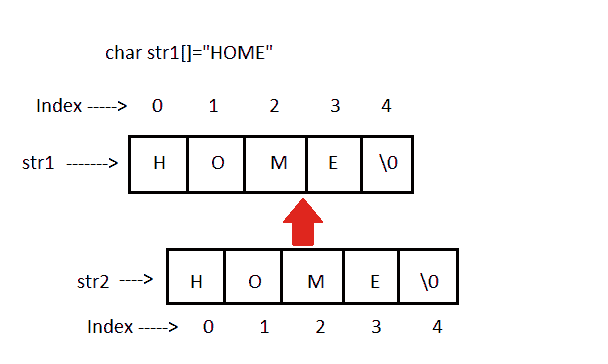
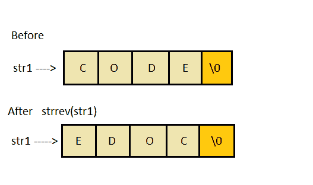

# 字符串和字符数组

> 原文：<https://www.studytonight.com/c/string-and-character-array.php>

**字符串**是被视为单个数据项的字符序列，以空字符`'\0'`结束。记住 [C 语言](https://www.studytonight.com/c/overview-of-c)不支持字符串作为数据类型。A **字符串**实际上是 C 语言中的一维字符数组。这些通常用于创建有意义和可读的程序。

如果不知道 C 语言中的数组是什么意思，可以查看 [C 数组](https://www.studytonight.com/c/arrays-in-c)教程，了解 C 语言中的数组。在继续之前，请查看以下文章:

*   [C 函数调用](https://www.studytonight.com/c/types-of-function-calls.php)

*   [C 变量](https://www.studytonight.com/c/variables-in-c.php)

*   [C 数据类型](https://www.studytonight.com/c/datatype-in-c.php)

*   [C 语法规则](https://www.studytonight.com/c/c-syntax.php)

**例如:**字符串“home”包含 5 个字符，包括编译器在字符串末尾自动添加的`'\0'`字符。



### 声明和初始化字符串变量:

```cpp
// valid
char name[13] = "StudyTonight";        
char name[10] = {'c','o','d','e','\0'};      

// Illegal
char ch[3] = "hello";    
char str[4];
str = "hello"; 
```

### 字符串输入和输出:

*   **%s** 格式说明符读取从终端输入的字符串。

*   但是 [scanf()](https://www.studytonight.com/c/c-input-output-function.php) 函数会在遇到的第一个空格处终止输入。

*   **编辑设置转换代码%[..】**可用于读取包含多种字符的行，包括空格。

*   `gets()`功能也可以用来读取带有空格的字符串

```cpp
char str[20];
printf("Enter a string");
scanf("%[^\n]", &str); 
printf("%s", str); 
```

```cpp
char text[20];
gets(text);
printf("%s", text);
```

### 字符串处理函数:

[C 语言](https://www.studytonight.com/c/overview-of-c)支持大量的字符串处理功能，可以用来执行许多字符串操作。这些功能封装在 **string.h** 库中。因此，您必须在程序中包含 **string.h** 头文件才能使用这些功能。

以下是最常用的字符串处理函数。

| 方法 | 描述 |
| `strcat()` | 它用于连接(组合)两个字符串 |
| `strlen()` | 它用于显示字符串的长度 |
| ``strrev()`` | 它用于显示字符串的反转 |
| `strcpy()` | 将一个字符串复制到另一个字符串中 |
| `strcmp()` | 它用于比较两个字符串 |

### `strcat()`功能在 C:



#### 语法:

```cpp
strcat("hello", "world");
```

`strcat()`将把字符串**“世界”**添加到**“你好”**即 ouput = helloworld。

### `strlen()`和`strcmp()`功能:

`strlen()`将返回传递给它的字符串的长度，`strcmp()`将返回两个字符串的第一个不匹配字符之间的 ASCII 差异。

```cpp
 int j = strlen("studytonight");
 int i=strcmp("study ", "tonight");
printf("%d %d",j,i);
```

12 -1

### `strcpy()`功能:

它将第二个字符串参数复制到第一个字符串参数。



#### `strcpy()`功能示例:

```cpp
#include<stdio.h>
#include<string.h>

int main()
{
    char s1[50], s2[50];

    strcpy(s1, "StudyTonight");     
    strcpy(s2, s1);     

    printf("%s\n", s2);

    return(0);
}
```

今晚学习

### `strrev()`功能:

它用于反转给定的字符串表达式。



#### `strrev()`的代码片段:

```cpp
#include <stdio.h>

int main()
{ 
    char s1[50]; 

    printf("Enter your string: "); 
    gets(s1);  
    printf("\nYour reverse string is: %s",strrev(s1)); 
    return(0); 
}
```

输入你的字符串:今晚学习
你的反串是:thginotyduts

<u>**相关教程:**</u>

*   [C 阵](https://www.studytonight.com/c/arrays-in-c.php)

*   [C 功能](https://www.studytonight.com/c/user-defined-functions-in-c.php)

*   [C 指针](https://www.studytonight.com/c/pointers-in-c.php)

*   [碳结构](https://www.studytonight.com/c/structures-in-c.php)

* * *

* * *