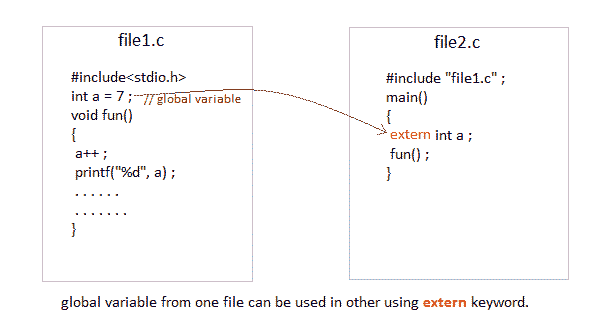

# C 语言中的存储类

> 原文：<https://www.studytonight.com/c/storage-classes-in-c.php>

在 C 语言中，每个变量都有一个存储类，它决定了以下事情:

*   **作用域**即程序中变量值可用的地方。
*   **缺省初始值**也就是说，如果我们没有明确初始化那个变量，它的缺省初始值会是什么。
*   **该变量的寿命**，即该变量将存在多长时间。

以下存储类最常用于 C 编程，

1.  **自动变量**
2.  **外部变量**
3.  **静态变量**
4.  **注册变量**

* * *

### 自动变量:`auto`

**作用域:**用`auto`存储类定义的变量对于定义它们的功能块是本地的。

**默认初始值:**任意随机值，即垃圾值。

**生存期:**直到定义变量的函数/方法块结束。

在没有任何存储类规范的函数内部声明的变量，默认情况下是一个**自动变量**。它们在函数被调用时被创建，并在函数执行完成时被自动销毁**。自动变量也可以称为**局部变量**，因为它们是函数的局部变量。默认情况下，编译器会为它们分配**垃圾值**。**

```cpp
#include<stdio.h>

void main()
{
    int detail;
    // or 
    auto int details;    //Both are same
}
```

* * *

### 外部或全局变量

**范围:**全局，即程序中的任何地方。这些变量不受任何函数的约束，它们无处不在。

**默认初始值:** 0(零)。

**生存期:**直到程序没有完成执行，可以访问全局变量。

在任何函数之外声明的变量是**全局变量**。全局变量在整个程序执行过程中保持可用。默认情况下，全局变量的初始值为 0(零)。关于全局变量要记住的一件重要的事情是，它们的值可以被程序中的任何函数改变。

```cpp
#include<stdio.h>

int number;     // global variable

void main()
{
    number = 10;
    printf("I am in main function. My value is %d\n", number);
    fun1();     //function calling, discussed in next topic
    fun2();     //function calling, discussed in next topic
}

/* This is function 1 */
fun1()
{
    number = 20;
    printf("I am in function fun1\. My value is %d", number);
}
/* This is function 1 */
fun2()
{
    printf("\nI am in function fun2\. My value is %d", number);
}
```

我在主功能。我的值是 10，我在函数 fun1 中。我的值是 20，我在函数 fun2 中。我的值是 20

这里，全局变量`number`对所有三个函数都可用，因此，如果一个函数改变了变量的值，它在每个函数中都会改变。

**注意:**对于程序中的所有变量，将存储类声明为全局或外部会浪费大量的内存空间，因为这些变量在程序结束之前都是有生命周期的。因此，直到程序结束之前都不需要的变量仍然会占用内存，从而浪费内存。

* * *

### `extern`关键字

`extern`关键字与一个变量一起使用，以通知编译器该变量在其他地方声明。`extern`声明不为变量分配存储。



#### 不使用 extern 时出现问题

```cpp
int main()
{
    a = 10;     //Error: cannot find definition of variable 'a'
    printf("%d", a);    
}
```

#### 在同一文件中使用 extern 的示例

```cpp
int main()
{
    extern int x;   //informs the compiler that it is defined somewhere else
    x = 10;      
    printf("%d", x);    
}
int x;      //Global variable x
```

* * *

### 静态变量

**范围:**定义变量的块的本地

**默认初始值:** 0(零)。

**生存期:**直到整个程序没有执行完。

一个`static`变量告诉编译器将变量保存/保存到程序结束。`static`变量只初始化一次，并一直存在到程序结束，而不是每次进入和退出范围时都创建和销毁变量。`static`变量可以是内部变量，也可以是外部变量，具体取决于申报地点。**内部静态**变量的范围保留在定义它的函数中。**外部静态**变量仍然被限制在声明它们的文件范围内。

编译器将它们指定为 **0(零)**默认值。

```cpp
#include<stdio.h>

void test();    //Function declaration (discussed in next topic)

int main()
{
    test();
    test();
    test();
}

void test()
{
    static int a = 0;       //a static variable
    a = a + 1;
    printf("%d\t",a);
}
```

1 2 3

* * *

### 寄存器变量

**作用域:**对声明它的函数是局部的。

**默认初始值:**任意随机值，即垃圾值

**寿命:**直到定义变量的函数/方法块结束。

寄存器变量通知编译器将变量存储在 CPU 寄存器中，而不是内存中。寄存器变量比普通变量具有更快的可访问性。通常，经常使用的变量保存在寄存器中。但是只有少数变量可以放在寄存器中。寄存器存储类的一个应用是使用循环，在很短的时间内，变量在程序中被多次使用。

**注:**我们永远无法得到这类变量的地址。

**语法:**

```cpp
register int number;
```

**注意:**即使我们已经将变量`number`的存储类声明为寄存器，我们也不能肯定地说变量的值会存储在寄存器中。这是因为中央处理器中寄存器的数量是有限的。此外，中央处理器寄存器意味着要做很多重要的工作。因此，有时他们可能不自由。在这种情况下，变量的工作方式就好像它的存储类是`auto`。

* * *

### 应该使用哪个存储类别以及何时使用

为了提高程序的执行速度并谨慎使用变量占用的内存空间，在使用存储类时应记住以下几点:

*   只有当我们希望变量的值在每次使用不同的函数调用时保持不变时，我们才应该使用`static`存储类。
*   我们应该只对那些经常在程序中使用的变量使用`register`存储类。中央处理器寄存器是有限的，因此应该谨慎使用。
*   我们应该只对那些被程序中几乎所有函数使用的变量使用外部或全局存储类。
*   如果我们没有任何上述存储类的目的，那么我们应该使用自动存储类。

* * *

* * ***