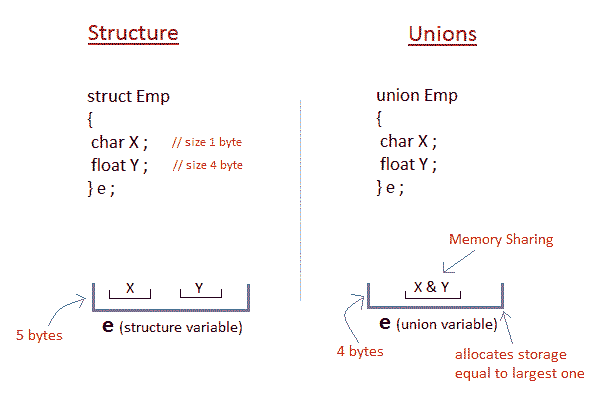

# 工会

> 原文：<https://www.studytonight.com/c/unions-in-c.php>

**工会**在概念上类似于 **[结构](structures-in-c.php)** 。声明/定义联合的语法也类似于结构的语法。唯一的区别是在存储方面。在**结构中**每个成员都有自己的存储位置，而**联合**的所有成员都使用一个共享内存位置，该位置等于其最大数据成员的大小。



这意味着尽管**工会**可能包含许多不同类型的成员，**却不能同时处理所有成员**。使用`union` [关键字](keywords-and-identifier.php)声明一个**联合**。

```cpp
union item
{
    int m;
    float x;
    char c;
}It1;
```

这声明了类型为`union item`的变量`It1`。这个`union`包含三个成员，每个成员都有不同的[数据类型](datatype-in-c.php)。然而，一次只能使用其中一个。这是因为所有`union`变量只分配了一个位置，而不管它们的大小如何。编译器分配的存储足够大，可以容纳联合中最大的变量类型。

在上面声明的联合中，成员`x`需要 **4 字节**，这在 16 位机器的成员中是最大的。联盟的其他成员将共享相同的内存地址。

* * *

## 访问 C 语言中的工会成员

访问任何`union`成员的语法与访问结构成员相似，

```cpp
union test
{
    int a;
    float b;
    char c;
}t;

t.a;    //to access members of union t
t.b;     
t.c;
```

* * *

### 举个例子

```cpp
 #include <stdio.h>

union item
{
    int a;
    float b;
    char ch;
};

int main( )
{
    union item it;
    it.a = 12;
    it.b = 20.2;
    it.ch = 'z';

    printf("%d\n", it.a);
    printf("%f\n", it.b);
    printf("%c\n", it.ch);

    return 0;
}
```

-26426 20.1999 z

从这里可以看到，`a`和`b`的值被破坏，只有变量`c`打印出预期的结果。这是因为在联合中，内存在不同的数据类型之间共享。因此，当前存储其值的唯一成员将拥有内存。

在上面的例子中，变量`c`的值最终被存储，因此其他变量的值丢失。

* * *

* * *