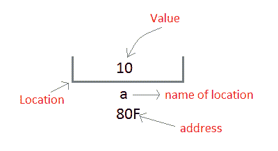
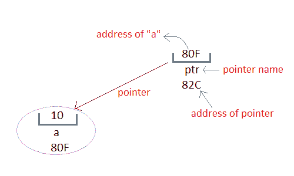

# C 指针介绍

> 原文：<https://www.studytonight.com/c/pointers-in-c.php>

C 语言中的指针是一个保存另一个相同[数据类型](datatype-in-c.php)变量地址的变量。

指针用于访问内存和操作地址。

指针是 C 语言最鲜明、最令人兴奋的特征之一。它为语言提供了力量和灵活性。虽然指针在一开始可能会显得有些混乱和复杂，但是相信我，一旦你理解了这个概念，你就能够用 C 语言做更多的事情。

在我们开始理解指针是什么以及它们能做什么之前，让我们先来理解“内存位置的地址”是什么意思？

* * *

## C 语言中的地址

每当用 C 语言定义一个[变量](variables-in-c.php)时，就给它分配一个存储位置，它的值将存储在这个位置。我们可以使用`&`符号轻松检查该内存地址。

如果`var`是变量的名称，那么`&var`会给出它的地址。

让我们编写一个小程序来查看我们在程序中定义的任何变量的内存地址。

```cpp
#include<stdio.h>

void main()
{
    int var = 7;
    printf("Value of the variable var is: %d\n", var);
    printf("Memory address of the variable var is: %x\n", &var);
}
```

变量 var 的值为:7 变量 var 的内存地址为:bcc7a00

你一定也看到了在[功能](user-defined-functions-in-c.php) `scanf()`中，我们提到`&var`来为任何变量`var`进行用户输入。

```cpp
scanf("%d", &var);
```

这用于将用户输入的值存储到变量`var`的地址。

* * *

## 指针的概念

每当在程序中声明一个**变量**时，系统在内存中为该变量分配一个位置，即一个地址，以保存分配的值。这个位置有自己的地址号码，我们刚刚在上面看到了。

让我们假设系统已经为变量`a`分配了内存位置`80F`。

`int a = 10;`



我们可以通过使用变量名`a`或者通过使用其地址`80F`来访问值`10`。

问题是我们如何使用变量的地址来访问它？由于内存地址也只是数字，它们也可以分配给其他变量。用于保存内存地址的变量称为**指针变量**。

因此**指针**变量只不过是一个保存其他变量地址的变量。一个**指针变量**的值被存储在另一个内存位置。



* * *

### 使用指针的好处

下面我们列出了使用指针的一些好处:

1.  指针在处理[数组](arrays-in-c.php)和[结构](structures-in-c.php)时更有效。
2.  指针允许引用函数，从而有助于将函数作为参数传递给其他函数。
3.  它减少了程序的长度和执行时间。
4.  它允许 C 语言支持动态内存管理。

在下一个教程中，我们将学习指针的语法，如何声明和定义指针，以及如何使用指针。下一课再见。

* * *

* * *