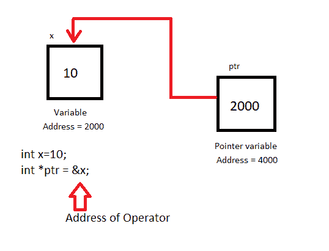
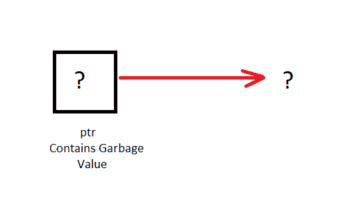

# C 语言中指针变量的声明、初始化和使用

> 原文：<https://www.studytonight.com/c/declaring-and-initializing-pointer.php>

在本教程中，我们将学习如何声明、初始化和使用[指针](https://www.studytonight.com/c/pointers-in-c.php)，以及空指针及其用法。

继续阅读前，请检查以下主题:

*   [碳阵列](https://www.studytonight.com/c/arrays-in-c.php)

*   [循环入 C](https://www.studytonight.com/c/loops-in-c.php)

*   [功能在 C](https://www.studytonight.com/c/user-defined-functions-in-c.php)

## C 指针变量的声明

指针声明的一般语法是，

```cpp
datatype *pointer_name;
```

指针的[数据类型](https://www.studytonight.com/c/datatype-in-c.php)和指针变量所指向的[变量](https://www.studytonight.com/c/variables-in-c.php)必须相同。

## C 指针变量的初始化

**指针初始化**是将变量的地址分配给**指针**变量的过程。它包含相同数据类型的变量的地址。在 C 语言中**地址运算符** `&`用于确定一个变量的地址。`&`(紧接在变量名之前)返回与之关联的变量的地址。

```cpp
int a = 10;
int *ptr;       //pointer declaration
ptr = &a;       //pointer initialization 
```



指针变量总是指向相同数据类型的变量。例如:

```cpp
float a;
int *ptr = &a;       // ERROR, type mismatch 
```

在声明指针变量时，如果它没有被赋给任何东西，那么它包含垃圾值。因此，建议为其赋值`NULL`，



在 C 中，被赋予`NULL`值的指针称为 [**空指针。**](https://www.studytonight.com/c/programs/pointer/null-pointer-program)

```cpp
 int *ptr = NULL;
```

### 使用指针或指针的解引用

一旦指针被分配了变量的地址，为了访问变量的值，使用**间接运算符**或**取消引用运算符** `*`，指针被取消引用。为了更好地理解，请考虑以下示例。

```cpp
#include <stdio.h>

int main()
{
    int a;  
    a = 10;
    int *p = &a;     // declaring and initializing the pointer

    //prints the value of 'a'
    printf("%d\n", *p);  
    printf("%d\n", *&a);  
    //prints the address of 'a'
    printf("%u\n", &a);    
    printf("%u\n", p);     

    printf("%u\n", &p);    //prints address of 'p'

    return 0;
}
```

10
10
3795480300
3795480300
3795480304

### 使用指针时要记住的点

*   声明/初始化指针变量时，`*`表示变量是指针。

*   任何变量的地址都是通过在变量名前面加上&符号`&`给出的。

*   指针变量存储变量的地址。

*   声明`int *a`并不意味着`a`将包含一个整数值。这意味着`a`将包含存储整数值的变量的地址。

*   使用指针变量`*`访问存储的某个地址的值。这里`*`可以理解为**在**的值。

既然我们已经学习了 C 语言中指针的基础知识，那么你可以使用指针来查看一些 [C 程序](https://www.studytonight.com/c/programs)。

<u>**阅读更多:**</u>

*   [简单指针程序](https://www.studytonight.com/c/programs/pointer/simple-pointer-program)

*   [指针程序数组](https://www.studytonight.com/c/programs/pointer/array-of-pointers)

*   [双指针](https://www.studytonight.com/c/pointer-to-pointer.php)

*   [带功能的指针](https://www.studytonight.com/c/pointer-with-function-in-c.php)

* * *

* * *