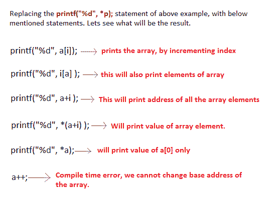
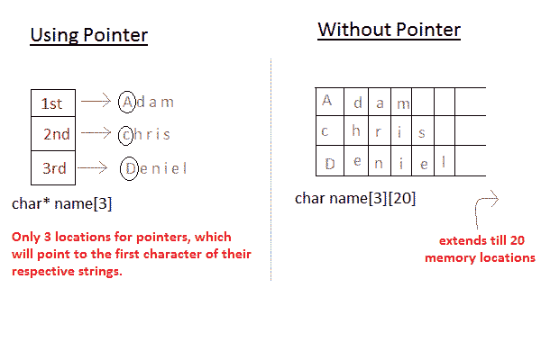

# C 语言中的指针和数组

> 原文：<https://www.studytonight.com/c/pointers-with-array.php>

在开始学习 C 语言中的指针和数组之前，请先了解以下主题:

*   [C 中的数组](https://www.studytonight.com/c/arrays-in-c.php)

*   [指针在 C](https://www.studytonight.com/c/pointers-in-c.php)

当 C 语言中的[数组](https://www.studytonight.com/c/arrays-in-c.php)被声明时，编译器分配足够的内存来包含它的所有元素。它的基址也是由编译器分配的。

声明一个数组`arr`，

```cpp
int arr[5] = { 1, 2, 3, 4, 5 };
```

假设`arr`的基址为 1000，每个整数需要两个字节，这五个元素将存储如下:


变量`arr`会给出基址，是一个常量[指针](https://www.studytonight.com/c/pointers-in-c.php)指向`arr[0]`。因此`arr`包含`arr[0]`的地址，即`1000`。

`arr`有两个目的——

*   这是数组的名称
*   它充当指向数组中第一个元素的指针。

> `arr`默认等于`&arr[0]`

为了更好地理解指针的声明和初始化- [点击这里。](https://www.studytonight.com/c/pointers-in-c.php)参照[程序](https://www.studytonight.com/c/programs/pointer/simple-pointer-program)执行。

**注:**

*   指针一旦递增，就不能递减。`p--`行不通。

## 指向数组的指针

使用[指针指向一个数组](https://www.studytonight.com/c/pointer-to-pointer.php)，然后使用该指针访问数组元素。例如，

```cpp
#include<stdio.h>

void main()
{
   int a[3] = {1, 2, 3};
   int *p = a;    
   for (int i = 0; i < 3; i++)
   {
      printf("%d", *p);
      p++;
   }
  return 0;
} 
```

1 2 3



**语法:**

```cpp
*(a+i)  //pointer with an array
```

与以下相同:

```cpp
a[i]
```

## 指向多维数组的指针

让我们看看如何使指针指向多维数组。在`a[i][j]`中，`a`会给出这个数组的基址，甚至`a + 0 + 0`也会给出基址，也就是`a[0][0]`元素的地址。

#### 语法:

```cpp
*(*(a + i) + j)
```

## 指针和字符串

指针用于创建字符串。`char`类型的指针变量被视为字符串。

```cpp
char *str = "Hello";
```

上面的代码创建了一个字符串，并将其地址存储在指针变量`str`中。指针`str`现在指向字符串“你好”的第一个字符。

*   使用`char`指针创建的字符串可以在**运行时**被赋值。

```cpp
char *str;
str = "hello"; 
```

*   可以使用`printf()`和`puts()`打印字符串的内容。

```cpp
printf("%s", str);
puts(str);
```

*   `str`是字符串的指针，也是字符串的名称。因此我们不需要使用间接运算符`*`。

## 指针数组

指针在处理具有不同长度行的字符数组时非常有用。

```cpp
char *name[3] = { 
    "Adam",
    "chris",
    "Deniel"
};
//without pointer
char name[3][20] = { 
    "Adam",
    "chris",
    "Deniel"
};
```



在第二种方法中，内存浪费更多，因此在这种情况下最好使用[指针](https://www.studytonight.com/c/pointers-in-c.php)。

<u>**建议教程:**</u>

*   [带功能的指针](https://www.studytonight.com/c/pointer-with-function-in-c.php)

*   [指向结构的指针](https://www.studytonight.com/c/pointers-to-structure-in-c.php)

*   [指针运算](https://www.studytonight.com/c/pointer-arithmetic-in-c.php)

*   [指向数组程序的指针](https://www.studytonight.com/c/programs/pointer/array-of-pointers)

* * *

* * *