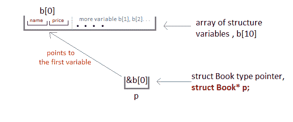

#  C 语言中的指向结构数组的指针

> 原文：<https://www.studytonight.com/c/pointers-to-structure-in-c.php>

就像我们有整数数组、[指针数组](pointers-with-array.php)等一样，我们也可以有结构变量数组。为了有效地使用结构变量数组，我们使用结构类型为的**指针。我们也可以有指向单个结构变量的指针，但它主要用于处理结构变量数组。**

```cpp
#include <stdio.h>

struct Book
{
    char name[10];
    int price;
}

int main()
{
    struct Book a;      //Single structure variable
    struct Book* ptr;   //Pointer of Structure type
    ptr = &a;

    struct Book b[10];  //Array of structure variables
    struct Book* p;     //Pointer of Structure type
    p = &b;  

    return 0;
}
```



* * *

## 用指针访问结构成员

为了使用结构变量访问结构的成员，我们使用了点`.`操作符。但是当我们有一个结构类型的指针时，我们使用箭头`->`来访问结构成员。

```cpp
#include <stdio.h>

struct my_structure {
    char name[20];
    int number;
    int rank;
};

int main()
{
    struct my_structure variable = {"StudyTonight", 35, 1};

    struct my_structure *ptr;
    ptr = &variable;

    printf("NAME: %s\n", ptr->name);
    printf("NUMBER: %d\n", ptr->number);
    printf("RANK: %d", ptr->rank);

    return 0;
}
```

姓名:学习今晚人数:35 排名:1

* * *

* * *