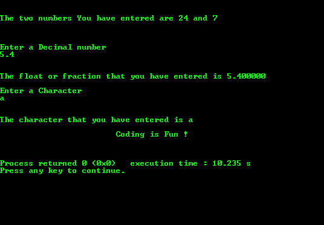

# C 程序：C 语言中的接受各种数据类型输入

> 原文：<https://www.studytonight.com/c/programs/basic/different-data-type-input>

下面是一个程序，解释如何从用户那里获取 C 语言中不同数据类型的输入。不同的数据类型是`int`(整数值)、`float`(十进制值)和`char`(字符值)。

下面是 C 语言教程，讲解各种数据类型→[C 语言中的数据类型](/c/datatype-in-c.php)

`printf()`用于在屏幕上显示文本

`&`用于将输入值赋给变量，并将其存储在该特定位置。

`scanf()`被设计为使用即将到来的教程中讨论的格式说明符从用户处获取输入

`%d`和`%i`，两者都是用来从用户那里接受数字作为输入的。

`%f`是将浮点作为用户输入的格式说明符

`%s`是将字符作为用户输入的格式说明符

```cpp
#include<stdio.h>

int main()
{
    printf("\n\n\t\tStudytonight - Best place to learn\n\n\n");

    int num1, num2;  
    float fraction;     
    char character;

    printf("Enter two numbers number\n");

    // Taking integer as input from user
    scanf("%d%i", &num1, &num2);
    printf("\n\nThe two numbers You have entered are %d and %i\n\n", num1, num2);

    // Taking float or fraction as input from the user
    printf("\n\nEnter a Decimal number\n");
    scanf("%f", &fraction); 
    printf("\n\nThe float or fraction that you have entered is %f", fraction);

    // Taking Character as input from the user
    printf("\n\nEnter a Character\n");
    scanf("%c",&character);
    printf("\n\nThe character that you have entered is %c", character);

    printf("\n\n\t\t\tCoding is Fun !\n\n\n");

    return 0;
}
```

### 输出:



* * *

* * *