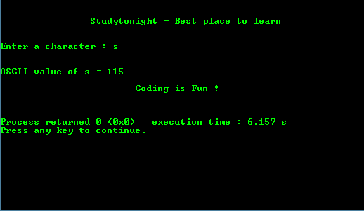

# 字符的 ASCII 值

> 原文:[https://www . study south . com/c/programs/basic/ascii-字符值](https://www.studytonight.com/c/programs/basic/ascii-value-of-character)

下面是一个查找任何输入字符的 ASCII 值的程序。

`%c`是以字符为输入的格式说明符

```cpp
#include<stdio.h>

int main()
{
    printf("\n\n\t\tStudytonight - Best place to learn\n\n\n");

    char c;
    printf("Enter a character : ");
    scanf("%c" , &c);
    printf("\n\nASCII value of %c = %d",c,c);

    printf("\n\n\t\t\tCoding is Fun !\n\n\n");
    return 0;
}
```

### 输出:



* * *

* * *