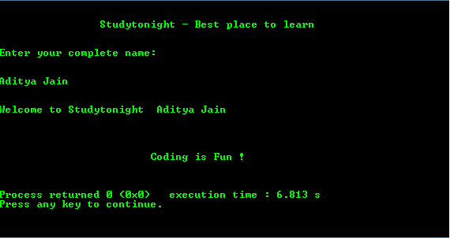

# 如何使用 get()函数

> 原文：<https://www.studytonight.com/c/programs/basic/use-of-gets>

关于`scanf()`和`gets()`的一些要点是:

*   `scanf()`和`gets()`都用于接受用户的输入。
*   `scanf()`只有遇到空格才能进行输入。空格后的单词被它忽略了。
*   `gets()`用于一次进行一次输入，但与 scanf()不同，可以用于输入带有空格的完整句子。

下面是`gets()`的使用程序。

`gets()`一次只取一行，即在按下\n(回车键)之前的所有单词。

```cpp
#include<stdio.h>

int main()
{
    printf("\n\n\t\tStudytonight - Best place to learn\n\n\n");

    char str[50];   // char array of size 50
    printf("Enter your complete name:\n\n\n");

    gets(str);
    printf("\n\nWelcome to Studytonight  %s\n\n\n", str);
    printf("\n\n\t\t\tCoding is Fun !\n\n\n");
    return 0;
}
```

### 输出:



* * *

* * *