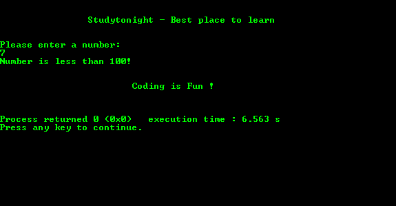

# 基本`if-else`条件程序

> 原文：<https://www.studytonight.com/c/programs/basic/if-else>

下面是`if` - `else`上的一个程序。

下面是 C 语言教程，解释 C 语言中的 If Else→[If Else](/c/decision-making-in-c.php)

```cpp
#include<stdio.h>

int main()
{
    printf("\n\n\t\tStudytonight - Best place to learn\n\n\n");

    int number;
    printf("Please enter a number:\n");
    scanf("%d",&number);
    /*
        For single statements we can skip the curly brackets
    */
    if(number < 100)
        printf("Number is less than 100!\n");
    else if(number == 100)
        printf("Number is 100!\n");
    else
        printf("Number is greater than 100!\n");

    printf("\n\n\t\t\tCoding is Fun !\n\n\n");

    return 0;
}
```

### 输出:



* * *

* * *