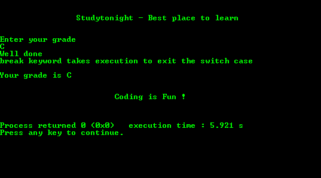
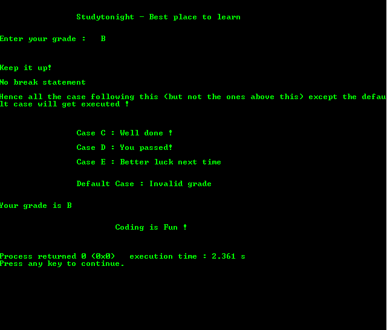

# C 程序：带有`break`的`switch-case`

> 原文：<https://www.studytonight.com/c/programs/basic/switch-case>

下面是一个带断点的`switch-case`程序。

`switch()`只能包含`char`和`int`。

`break`用于退出**开关**语句。

**切换**的情况可以不用**默认**的情况。

另一个信息是`char`变量总是在`''`内初始化(单引号)。

下面是 C 语言教程，讲解 C 中的`switch-case`→ [`switch-case`](/c/switch-statement-in-c.php)

```cpp
#include<stdio.h>

int main()
{
    printf("\n\n\t\tStudytonight - Best place to learn\n\n\n");

    // Local Variable Definition
    char grade;
    printf("Enter your grade:\n");
    scanf("%c", &grade);

    switch(grade)
    {
        case 'A':
            printf("Excellent\n");
            break;
        case 'B':
            printf("Keep it up!\n\n");
            break;
        case 'C':
            printf("Well done\nbreak keyword takes execution to exit the switch case\n\n");
            break;
        case 'D':
            printf("You passed\n");
            break;
        case 'F':
            printf("Better luck next time\n");
            break;
        default:
            printf("Invalid grade\n");
    }
    printf("Your grade is %c\n",grade);
    printf("\n\n\t\t\tCoding is Fun !\n\n\n");
    return 0;
}
```

### 输出:



* * *

## 不带`break`的开关箱

下面是一个关于`switch-case`的程序，没有中断。

如果没有`break`语句，则除`default`之外的匹配案例后面的案例将被执行。

```cpp
#include<stdio.h>

int main()
{
    printf("\n\n\t\tStudytonight - Best place to learn\n\n\n");

    /* Local Variable Definition */
    char grade;
    printf("Enter your grade:\n");
    scanf("%c", &grade);

    switch(grade)
    {
        case 'A':
            printf("Excellent\n");
        case 'B':
            printf("\n\n\nKeep it up!\n\nNo break statement\n\nHence all the case following this(but not the ones above this) except the default case will get executed !\n\n");
        case 'C':
            printf("\n\n\t\tCase C : Well done !\n\n");
        case 'D':
            printf("\t\tCase D : You passed!\n\n");
        case 'F':
            printf("\t\tCase E : Better luck next time\n\n\n");
        default:
            printf("\t\tDefault Case : Invalid grade\n\n\n");
    }
    printf("Your grade is %c\n",grade);
    printf("\n\n\t\t\tCoding is Fun !\n\n\n");
    return 0;
}
```

### 输出:



* * *

* * *