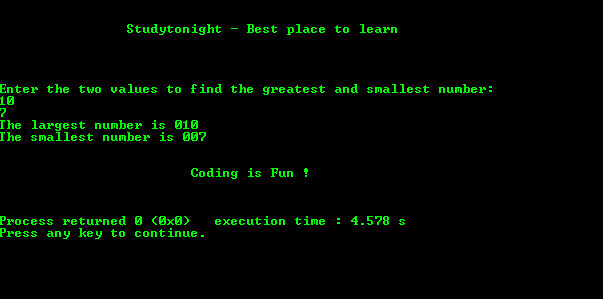

# C 程序：使用全局声明打印最大和最小

> 原文：<https://www.studytonight.com/c/programs/basic/largest-and-smallest-using-global-declaration>

关于全局变量声明的一些要点是:

*   它可以在程序中的任何地方完成。
*   与可以在特定函数范围内使用的局部变量不同。
*   `&`用于将输入值赋给变量，并将其存储在该特定位置。

`%0nd`用于表示`n`数字格式的数字，以 0 开头

下面是一个使用全局声明寻找最大值和最小值的程序。

```cpp
#include<stdio.h>

int a,b;
int main()
{
    printf("\n\n\t\tStudytonight - Best place to learn\n\n\n");
    printf("\n\nEnter the two values to find the greatest and smallest number: \n");
    scanf("%d%d", &a, &b);

    if(a == b)
        printf("Both are equal\n");

    else if(a < b)
    {
        printf("\n\nThe largest number is %03d\n", b);
        printf("\nThe smallest number is %03d\n", a);
        printf("\nThe largest number is %03d\n", b);
    }
    else    //Only possibility remaining
    {
        printf("The largest number is %03d\n", a);
        printf("The smallest number is %03d\n", b);
    }
    printf("\n\n\t\t\tCoding is Fun !\n\n\n");
    return 0;
}
```

### 输出:



* * *

* * *