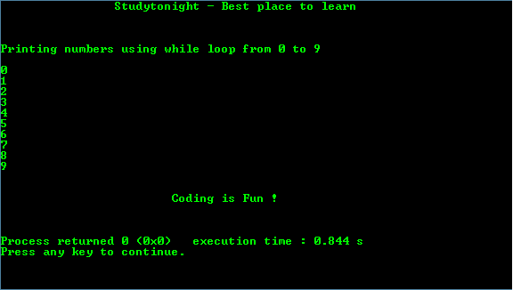

# 简单的`while`循环程序

> 原文：<https://www.studytonight.com/c/programs/loop/while-loop>

每个循环依次由三个部分组成

1.  **初始化**:用于初始化循环变量。
2.  **条件**:每次迭代后检查，作为循环的入口点。
3.  **更新**:增加循环变量，最终终止不满足循环条件的循环。

这是 C 语言教程，解释了在 C 中循环时→ [和循环时](/c/loops-in-c.php)

下面是一个关于`while`循环的简单程序。

```cpp
#include<stdio.h>

int main()
{
    printf("\n\n\t\tStudytonight - Best place to learn\n\n\n");

    /* 
        always declare the variables before using them 
    */
    int i = 0;  // declaration and initialization at the same time

    printf("\nPrinting numbers using while loop from 0 to 9\n\n");

    /* 
        while i is less than 10 
    */
    while(i<10)
    {
        printf("%d\n",i);

        /* 
            Update i so the condition can be met eventually 
            to terminate the loop 
        */
        i++;    // same as i=i+1;
      }
    printf("\n\n\t\t\tCoding is Fun !\n\n\n");
    return 0;
}
```

### 输出:



* * *

* * *