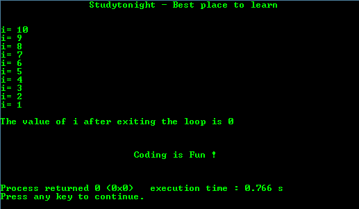

# 基本边循环边做程序

> 原文:[https://www.studytonight.com/c/programs/loop/do-while-loop](https://www.studytonight.com/c/programs/loop/do-while-loop)

每个循环依次由三部分组成:

1.  **初始化**:用于初始化循环变量。
2.  **条件**:每次迭代后检查，作为循环的入口点。
3.  **更新**:增加循环变量，最终终止不满足循环条件的循环。

这是 C 语言教程，解释了在 C 语言中循环时做→ [在循环时做](/c/loops-in-c.php)

当实际代码必须至少执行一次**时，使用 Do while 循环。例如:在菜单驱动功能的情况下。**

 **下面是一个关于 do while 循环的简单程序。

```cpp
#include<stdio.h>

int main()
{
    printf("\n\n\t\tStudytonight - Best place to learn\n\n\n");

    /* 
        always declare the variables before using them 
    */
    int i = 10;     // declaration and initialization at the same time

    do // do contains the actual code and the updation
    {
        printf("i = %d\n",i);
        i = i-1;    // updation
    }
    // while loop doesn't contain any code but just the condition
    while(i > 0);

    printf("\n\The value of i after exiting the loop is %d\n\n", i);
    printf("\n\n\t\t\tCoding is Fun !\n\n\n");
    return 0;
}
```

### 输出:



* * *

* * ***