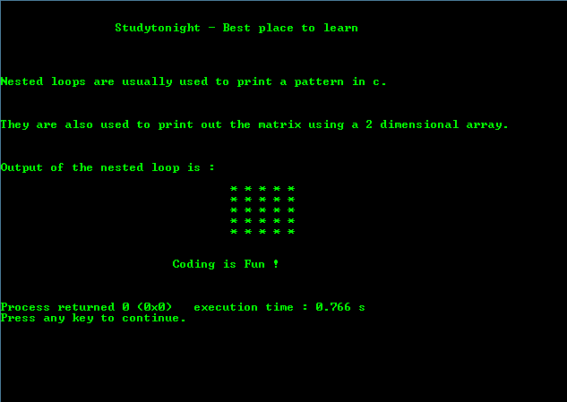

# 显示循环嵌套使用的基本程序

> 原文：<https://www.studytonight.com/c/programs/loop/nested-loops>

嵌套循环通常用于打印 C 语言中的模式。它们也用于使用二维数组和许多其他模式(如数字金字塔等)打印出矩阵。

下面是 C 语言教程，解释循环的嵌套→ [在 C 语言中循环的嵌套](/c/loops-in-c.php)

在另一个循环中使用一个循环称为**嵌套循环**。

下面是一个关于嵌套循环的简单程序。

```cpp
#include<stdio.h>

int main()
{
    printf("\n\n\t\tStudytonight - Best place to learn\n\n\n");
    printf("\n\nNested loops are usually used to print a pattern in c. \n\n");
    printf("\n\nThey are also used to print out the matrix using a 2 dimensional array. \n\n");

    int i,j,k;
    printf("\n\nOutput of the nested loop is :\n\n");
    for(i = 0; i < 5; i++)
    {
        printf("\t\t\t\t");
        for(j = 0; j < 5; j++)
        printf("* ");

        printf("\n");
    }
    printf("\n\n\t\t\tCoding is Fun !\n\n\n");
    return 0;
}
```

### 输出:



* * *

* * *