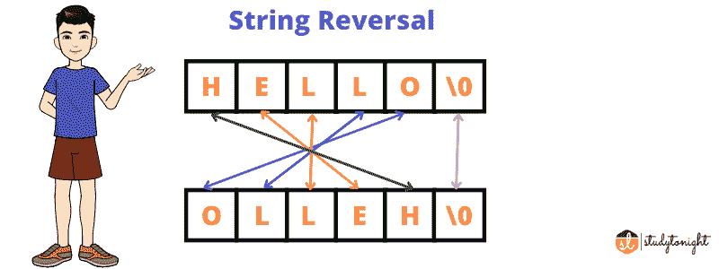

# 反转字符串的程序

> 原文:[https://www . study south . com/c/programs/loop/reverse-a-string-program](https://www.studytonight.com/c/programs/loop/reverse-a-string-program)

在本教程中，我们将学习如何反转给定的字符串。如果字符串是`"hello"` ，那么输出应该是`"olleh"`。我们可以用这个概念来检查回文。因为回文字符串即使在我们反转后也会有相同的值。

如果不熟悉 [C 程序](https://www.studytonight.com/c/programs/)，建议通读这些题目。

*   [C 语言概述](https://www.studytonight.com/c/overview-of-c)

*   [C 中的字符串和字符数组](https://www.studytonight.com/c/string-and-character-array)



主要有三种方法来保留给定的字符串:

*   通过使用新的字符数组。

*   通过交换字符串的字符。

*   通过使用标准库函数。

## 使用新的字符数组反转字符串:

在这个例子中，首先我们接受用户的输入，在接受输入后，我们必须计算字符串的长度。为了计算长度，我们从字符数组的开始运行一个循环，直到找到一个空字符(`'\0'`)，并且在每次迭代中，我们增加计数变量。我们给 j 分配一个比它小的值，因为数组从零开始。在这之后，我们简单地将字符从结尾一个接一个地从原始字符数组复制到新的字符数组。

```cpp
#include <stdio.h>
int main()
{
  char str[1000], rev[1000];
  int i, j, count = 0;
  scanf("%s", str);
  printf("\nString Before Reverse: %s", str);
  //finding the length of the string
  while (str[count] != '\0')
  {
    count++;
  }
  j = count - 1;

  //reversing the string by swapping
  for (i = 0; i < count; i++)
  {
    rev[i] = str[j];
    j--;
  }

  printf("\nString After Reverse: %s", rev);
}
```

你好

反转前串:你好
反转后串:olleH

* * *

## 通过交换字符串的字符来反转字符串

本示例将通过交换字符对字符串进行排序。

```cpp
#include <stdio.h>
#include <string.h>
void reverseStr(char str[])
{
  int n = strlen(str);

  for (int i = 0; i < n / 2; i++)
  {
    char ch = str[i];
    str[i] = str[n - i - 1];
    str[n - i - 1] = ch;
  }
}

int main()
{
  char str[1000];
  scanf("%s", str);
  printf("\nString Before Reverse: %s", str);
  reverseStr(str);
  printf("\nString After Reverse: %s", str);
  return 0;
} 
```

你好

反转前串:你好
反转后串:olleH

<u>**建议教程:**</u>

*   [字符串和字符数组](https://www.studytonight.com/c/string-and-character-array.php)

*   [C 中的数组](https://www.studytonight.com/c/arrays-in-c.php)

*   [功能在 C](https://www.studytonight.com/c/user-defined-functions-in-c.php)

*   [C 中的指针](https://www.studytonight.com/c/pointers-in-c.php)

* * *

* * *