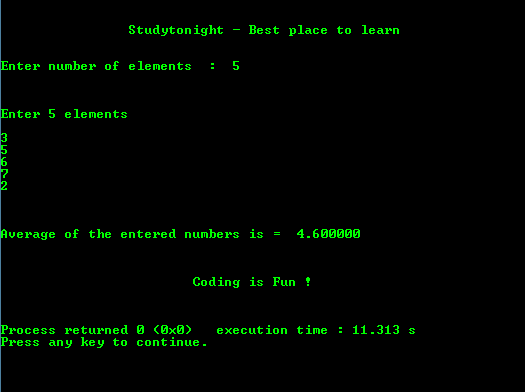

# 求 N 个数平均值的程序

> 原文：<https://www.studytonight.com/c/programs/numbers/average-of-n-numbers>

下面是一个计算 **n 个**数字平均值的程序。

```cpp
#include<stdio.h>

int main()
{
    printf("\n\n\t\tStudytonight - Best place to learn\n\n\n");

    int n, i;
    float sum = 0, x;

    printf("Enter number of elements:  ");
    scanf("%d", &n);
    printf("\n\n\nEnter %d elements\n\n", n);
    for(i = 0; i < n; i++)
    {
        scanf("%f", &x);
        sum += x;
    }
    printf("\n\n\nAverage of the entered numbers is =  %f", (sum/n));
    printf("\n\n\n\n\t\t\tCoding is Fun !\n\n\n");
    return 0;
}
```

### 输出:



* * *

* * *