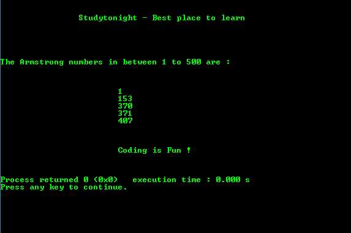
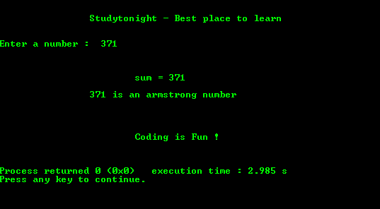

# 寻找阿姆斯特朗号码在 1 到 500 之间的程序

> 原文:[https://www . study south . com/c/programs/numbers/Armstrong-number-program](https://www.studytonight.com/c/programs/numbers/armstrong-number-program)

一个**阿姆斯壮数**或**自恋数**是一个 **n** 位数，这样其上升到 n 次方的位数之和等于该数本身。

举个例子，我们来看一个阿姆斯壮号:`153`，是 3 位数，这里`1<sup>3</sup> + 5<sup>3</sup> + 3<sup>3</sup>`是`1 + 125 + 27`，等于 **153** 。

下面是一个程序，用于查找 1 到 500 之间的阿姆斯特朗数字。

```cpp
#include<stdio.h>
#include<math.h>

int main()
{
    printf("\n\n\t\tStudytonight - Best place to learn\n\n\n");
    int n,sum,i,t,a;
    printf("\n\n\nThe Armstrong numbers in between 1 to 500 are : \n\n\n");

    for(i = 1; i <= 500; i++)
    {
        t = i;  // as we need to retain the original number
        sum = 0;
        while(t != 0)
        {
            a = t%10;
            sum += a*a*a;
            t = t/10;
        }

        if(sum == i)
        printf("\n\t\t\t%d", i);
    }

    printf("\n\n\n\n\t\t\tCoding is Fun !\n\n\n");
    return 0;
}
```

### 输出:



* * *

## 检查一个号码是否是阿姆斯特朗号码的程序

下面是一个检查一个号码是否是阿姆斯特朗的程序。

```cpp
#include<stdio.h>
#include<math.h>

int main()
{
    printf("\n\n\t\tStudytonight - Best place to learn\n\n\n");

    int n, sum = 0, c, t, a;

    printf("Enter a number:  ");
    scanf("%d", &n);

    t = n;  // as need to retain the original number
    while(n != 0)
    {
        a = n%10;
        sum += a*a*a;
        n = n/10;
    }

    printf("\n\n\n\t\t\tsum = %d", sum);

    if(sum == t)
        printf("\n\n\t\t%d is an armstrong number\n", t);
    else
        printf("\n\n\t\t%d is not an armstrong number\n", t);

    printf("\n\n\n\n\t\t\tCoding is Fun !\n\n\n");
    return 0;
}
```

### 输出:



* * *

* * *