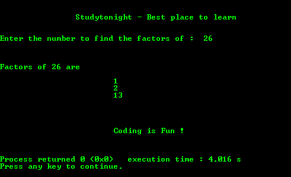

# 寻找数字因子的程序

> 原文:[https://www . study south . com/c/programs/numbers/a-of-number](https://www.studytonight.com/c/programs/numbers/factors-of-a-number)

下面是一个寻找数字因子的程序。

```cpp
#include<stdio.h>

int main()
{
    printf("\n\n\t\tStudytonight - Best place to learn\n\n\n");
    int  num, i;
    printf("Enter the number to find the factors of :  ");
    scanf("%d",&num);
    printf("\n\n\nFactors of %d are \n\n", num);

    for(i = 1; i <= num/2; i++)
    {
        if(num%i == 0)
            printf("\t\t\t%d\n", i);
    }

    printf("\n\n\n\n\t\t\tCoding is Fun !\n\n\n");
    return 0;
}
```

### 输出:



* * *

* * *