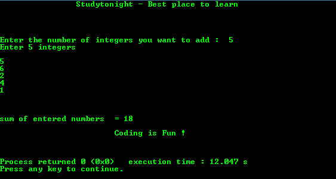

# C 程序：用 C 语言求 N 个输入数之和

> 原文：<https://www.studytonight.com/c/programs/numbers/sum-of-n-numbers>

下面是一个关于 n 个数和的程序。

```cpp
#include<stdio.h>

int main()
{
    printf("\n\n\t\tStudytonight - Best place to learn\n\n\n");
    int n,sum=0,c,value;

    printf("\n\nEnter the number of integers you want to add:  ");
    scanf("%d", &n);

    printf("Enter %d integers\n\n",n);
    for(c = 1; c <= n; c++)
    {
        scanf("%d", &value);
        /* 
            need to initialise sum before using otherwise 
            garbage value will get printed
        */
        sum += value;
    }

    printf("\n\n\nsum of entered numbers  = %d", sum);
    printf("\n\n\t\t\tCoding is Fun !\n\n\n");
    return 0;
}
```

### 输出:



* * *

* * *