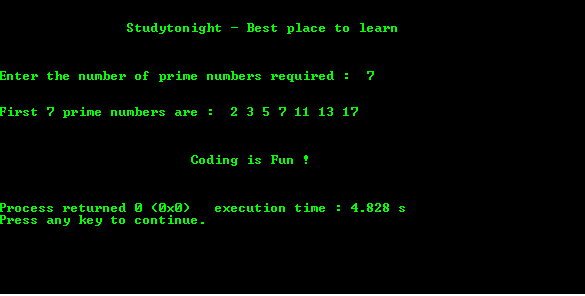

# C 程序：寻找前`N`个质数

> 原文：<https://www.studytonight.com/c/programs/numbers/first-n-prime-numbers>

下面是一个使用嵌套`for`循环首先找到`n`质数的程序，其中`n`的值由用户输入。

在您继续使用程序之前，请检查以下主题以了解程序:

*   [C 中的循环](/c/loops-in-c.php)
*   [对于 C 中的循环程序](/c/programs/loop/for-loop)
*   [嵌套用于 C 中的循环程序](/c/programs/loop/nested-loops)

```cpp
#include<stdio.h>

int main()
{
    printf("\n\n\t\tStudytonight - Best place to learn\n\n\n");
    int n,i = 3, count, c;

    printf("\nEnter the number of prime numbers required :  ");
    scanf("%d", &n);

    if(n >= 1)
    {
        printf("\n\nFirst %d prime numbers are :  ", n);
        printf("2 ");
    }

    // iteration for n prime numbers
    // i is the number to be checked in each iteration starting from 3
    for(count = 2; count <= n; i++)  
    {
        // iteration to check c is prime or not
        for(c = 2; c < i; c++)
        {
            if(i%c == 0)
                break;
        }

        if(c == i)  // c is prime
        {
            printf("%d ", i);
            count++;    // increment the count of prime numbers
        }

    }
    printf("\n\n\n\n\t\t\tCoding is Fun !\n\n\n");
    return 0;
}
```

### 输出:



* * *

* * *