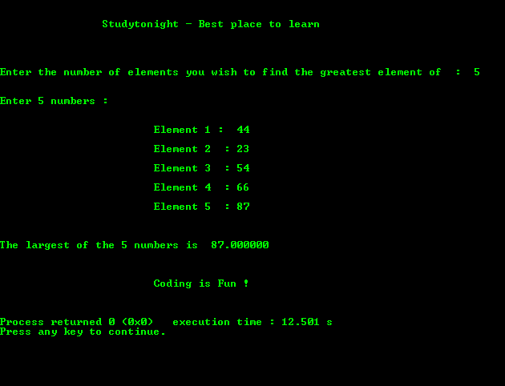

# 在 n 个输入数字中找出最大数字的程序

> 原文:[https://www . study south . com/c/programs/numbers/find-n 个数字中最大的](https://www.studytonight.com/c/programs/numbers/finding-largest-among-n-numbers)

下面是一个在`n`用户输入数字中寻找最大数字的程序。

```cpp
#include<stdio.h>

int main()
{
    printf("\n\n\t\tStudytonight - Best place to learn\n\n\n");
    int n,i;
    float c,big;

    printf("\n\nEnter the number of elements you wish to find the greatest element of: ");
    scanf("%d", &n);
    printf("\n\nEnter %d numbers :\n", n);

    printf("\n\n\t\t\tElement 1: ");

    //Important step- always initialize big to the first element
    scanf("%f", &big);

    for(i = 2; i <= n; i++)
    {
        printf("\n\t\t\tElement %d  : ", i);
        scanf("%f", &c);
        /* 
            if input number is larger than the 
            current largest number
        */
        if(big < c)  
            big = c;    // update big to the larger value
    }

    printf("\n\n\nThe largest of the %d numbers is  %f ", n, big);
    printf("\n\n\n\n\t\t\tCoding is Fun !\n\n\n");
    return 0;
}
```

### 输出:



* * *

* * *