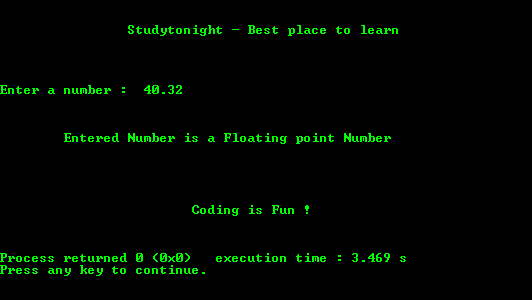

# 检查输入数字是整数还是浮点数的程序

> 原文:[https://www . study south . com/c/programs/numbers/input-number-is-int-or-float](https://www.studytonight.com/c/programs/numbers/input-number-is-int-or-float)

下面是一个检查用户输入的数字是整数还是浮点数据类型的程序。

`strlen()`不计算空字符“\0”。

```cpp
#include<stdio.h>

#include<conio.h>
#include<string.h>

int main()
{
    printf("\n\n\t\tStudytonight - Best place to learn\n\n\n");
    char number[10];
    int flag = 0;
    int length, i = 0;

    printf("\n\nEnter a number: ");
    scanf("%s", number);

    length = strlen(number);

    // till string does not end
    while(number[i++] != '\0')    // same as while(length-->0)
    {
        if(number[i] == '.')    // decimal point is present
        {
            flag = 1;
            break;
        }
    }

    // if(0) is same as if(false)
    if(flag)
        printf("\n\n\n\tEntered Number is a Floating point Number\n\n");
    else
        printf("\n\n\n\tEntered Number is a integer Number\n\n");

    printf("\n\n\n\n\t\t\tCoding is Fun !\n\n\n");
    return 0;
}
```

### 输出:



* * *

* * *