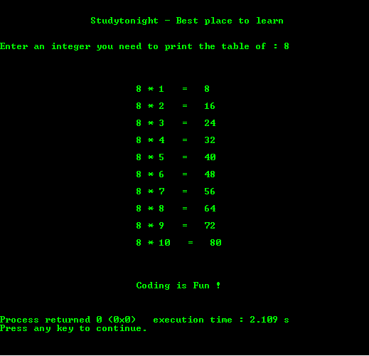

# C 程序：打印任意数字的乘法表

> 原文：<https://www.studytonight.com/c/programs/numbers/multiplication-table-of-a-number>

下面是一个打印任意用户输入数字的乘法表的程序。

```cpp
#include<stdio.h>

int main()
{
    printf("\n\n\t\tStudytonight - Best place to learn\n\n\n");
    int n,i;

    printf("Enter an integer you need to print the table of: ");
    scanf("%d", &n);
    printf("\n\n\n");

    for(i = 1; i <= 10; i++)
    {
        printf("\n\t\t\t%d * %d   =   %d \n", n, i, n*i);
    }

    printf("\n\n\n\n\t\t\tCoding is Fun !\n\n\n");
    return 0;
}
```

### 输出:



* * *

* * *