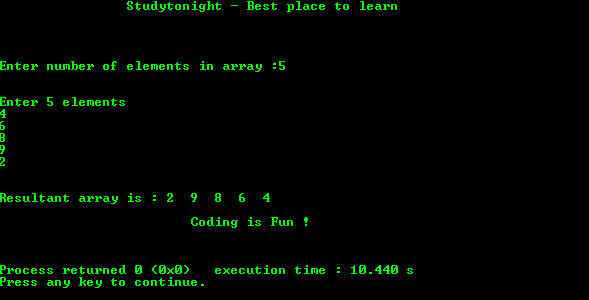

# 打印阵列反面的程序

> 原文：<https://www.studytonight.com/c/programs/array/reverse-an-array>

下面是一个反转数组的简单程序。

```cpp
#include<stdio.h>

int main()
{
    printf("\n\n\t\tStudytonight - Best place to learn\n\n\n");

    int c, d, n, a[100], b[100];
    printf("\n\nEnter number of elements in array :");
    scanf("%d", &n);
    printf("\n\nEnter %d elements\n", n);

    for(c = 0; c < n; c++)
        scanf("%d", &a[c]);

    /*
        temporarily storing elements into array b 
        starting from end of array a
    */
    for(c = n-1, d = 0; c >= 0; c--, d++)
        b[d] = a[c];

    /*
        copying reversed array into original.
        Here we are modifying original array to reverse it.
    */

    for(c = 0; c < n; c++)
        a[c] = b[c];

    printf("\n\n Resultant array is: ");
    for(c = 0; c < n; c++)
        printf("%d", a[c]);

    printf("\n\n\t\t\tCoding is Fun !\n\n\n");
    return 0;
}
```

### 输出:



* * *

* * *