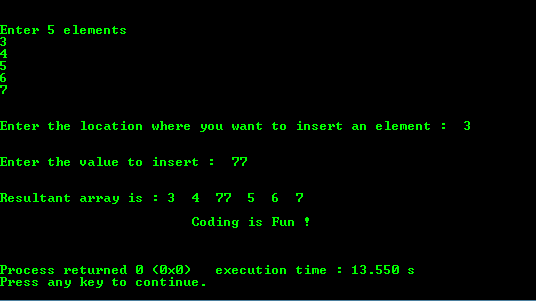

# C 程序：在数组中插入元素

> 原文：<https://www.studytonight.com/c/programs/array/inserting-an-element-in-array>

下面是一个在数组中插入元素的简单程序。

下面是 C 语言教程，讲解数组→[C 语言中的数组](/c/arrays-in-c.php)

```cpp
#include<stdio.h>

int main()
{
    printf("\n\n\t\tStudytonight - Best place to learn\n\n\n");
    int array[100], position, c, n, value;

    printf("\n\nEnter number of elements in array:");
    scanf("%d", &n);

    printf("\n\nEnter %d elements\n", n);
    for(c = 0; c < n; c++)
        scanf("%d", &array[c]);

    printf("\n\nEnter the location where you want to insert new element:  ");
    scanf("%d", &position);

    printf("\n\nEnter the value to insert: ");
    scanf("%d", &value);

    // shifting the elements from (position to n) to right
    for(c = n-1; c >= position-1; c--)
        array[c+1] = array[c];

    array[position - 1] = value;    // inserting the given value

    printf("\n\nResultant array is: ");
    /* 
        the array size gets increased by 1 
        after insertion of the element
    */
    for(c = 0; c <= n; c++) 
        printf("%d  ", array[c]);

    printf("\n\n\t\t\tCoding is Fun !\n\n\n");
    return 0;
}
```

在上面的程序中，我们将一个数组作为用户输入，然后向用户询问他们想要添加到原始数组中的新数字，以及他们想要添加新数字的位置。

我们将现有的数字从索引**位置**移到数组末尾的右边一个位置，从而为新元素留出空间。然后我们在用户指定的**位置**索引处添加新的数字。

### 输出:



* * *

* * *