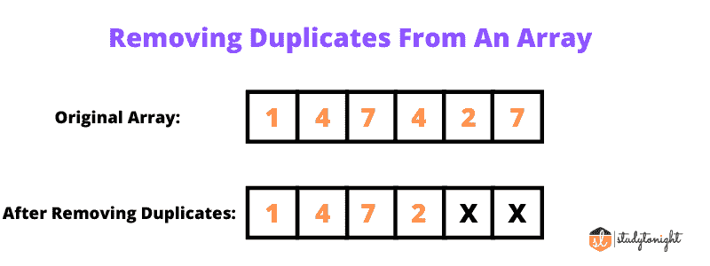

# C 程序：删除数组中重复元素

> 原文：<https://www.studytonight.com/c/programs/array/remove-duplicate-element-program>

在本教程中，我们将学习如何从[数组](https://www.studytonight.com/c/arrays-in-c.php)中移除重复的元素。在继续这个程序之前，如果你不熟悉什么是[数组](https://www.studytonight.com/c/arrays-in-c.php)，请阅读这篇文章:[C 语言数组](https://www.studytonight.com/c/arrays-in-c)。



## 从排序的数组中删除重复项:

这里我们实现了从排序数组中移除重复元素的程序。我们将创建一个临时数组，并将元素从一个数组复制到另一个数组，以防没有下一个匹配的元素。

**注意:** 这个程序只对排序数组起作用，所以在提供输入的同时，要确保给定的数组在排序数组中，否则会给出意外的输出。

```cpp
#include <stdio.h>
int remove_duplicate(int arr[], int n)
{

  if (n == 0 || n == 1)
    return n;

  int temp[n];

  int j = 0;
  int i;
  for (i = 0; i < n - 1; i++)
    if (arr[i] != arr[i + 1])
      temp[j++] = arr[i];
  temp[j++] = arr[n - 1];

  for (i = 0; i < j; i++)
    arr[i] = temp[i];

  return j;
}

int main()
{
  int n;
  scanf("%d", &n);
  int arr[n];
  int i;
  for (i = 0; i < n; i++)
  {
    scanf("%d", &arr[i]);
  }
  printf("\nArray Before Removing Duplicates: ");
  for (i = 0; i < n; i++)
    printf("%d ", arr[i]);

  n = remove_duplicate(arr, n);

  printf("\nArray After Removing Duplicates: ");
  for (i = 0; i < n; i++)
    printf("%d ", arr[i]);

  return 0;
}
```

10
1 2 2 3 4 5 6 7 8
T3】删除重复项前的数组:1 2 2 3 4 5 6 7 8
删除重复项后的数组:1 2 3 4 5 6 7 8

## 从未排序的数组中删除重复项:

在这个程序中，我们将占用额外的空间来存储一个没有重复元素名声的新数组。我们将运行一个嵌套循环，首先是将元素从数组复制到 temp 数组，如果该元素已经存在于 temp 变量中，那么我们将中断内部循环，并继续对剩余的元素执行相同的过程。

```cpp
#include <stdio.h>
int main()
{
  int n, count = 0;
  scanf("%d", &n);
  int arr[n], temp[n];
  for (int i = 0; i < n; i++)
  {
    scanf("%d", &arr[i]);
  }

  printf("\nArray Before Removing Duplicates: ");
  for (int i = 0; i < n; i++)
    printf("%d ", arr[i]);

  for (int i = 0; i < n; i++)
  {
    int j;
    for (j = 0; j < count; j++)
    {
      if (arr[i] == temp[j])
        break;
    }
    if (j == count)
    {
      temp[count] = arr[i];
      count++;
    }
  }

  printf("\nArray After  Removing Duplicates: ");
  for (int i = 0; i < count; i++)
    printf("%d ", temp[i]);

  return 0;
}
```

10
1 2 2 3 4 5 6 7 8
消除重复项前的数组:1 2 2 3 4 5 6 7 7 8
消除重复项后的数组:1 2 3 4 5 6 7 8

**建议教程:**

*   [C 中的数组](https://www.studytonight.com/c/arrays-in-c.php)

*   [C 中的循环](https://www.studytonight.com/c/loops-in-c.php)

*   [功能在 C](https://www.studytonight.com/c/user-defined-functions-in-c.php)

*   [文件输入/输出用 C 语言](https://www.studytonight.com/c/file-input-output.php)

* * *

* * *