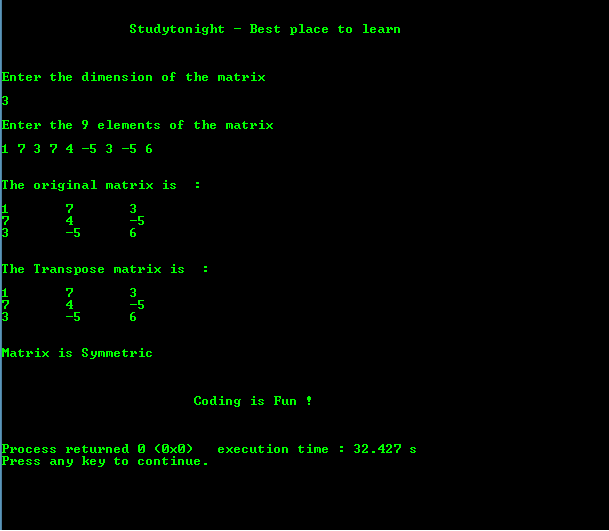

# C 程序：检查给定方阵是否对称

> 原文：<https://www.studytonight.com/c/programs/array/check-square-matrix-is-symmetric-or-not>

需要记住的几个要点:

*   如果一个方阵等于它的**转置**，那么它就是对称的。
*   矩阵的转置是通过交换行和列的**索引**来实现的。
*   转置只为方阵定义。

下面是一个检查 sqaure 矩阵是否对称的程序。

```cpp
#include<stdio.h>

int main()
{
    printf("\n\n\t\tStudytonight - Best place to learn\n\n\n");

    int c, d, a[10][10], b[10][10], n, temp;
    printf("\nEnter the dimension of the matrix: \n\n");
    scanf("%d", &n);

    printf("\nEnter the %d elements of the matrix: \n\n",n*n);
    for(c = 0; c < n; c++) // to iterate the rows
        for(d = 0; d < n; d++) // to iterate the columns
            scanf("%d", &a[c][d]);

    // finding transpose of a matrix and storing it in b[][]
    for(c = 0; c < n; c++) // to iterate the rows
        for(d = 0; d < n; d++) //to iterate the columns
            b[d][c] = a[c][d];

    // printing the original matrix
    printf("\n\nThe original matrix is: \n\n");
    for(c = 0; c < n; c++)   // to iterate the rows
    {
        for(d = 0; d < n; d++)   // to iterate the columns
        {
            printf("%d\t", a[c][d]);
        }
    printf("\n");
    }

    // printing the transpose of the entered matrix
    printf("\n\nThe Transpose matrix is: \n\n");
    for(c = 0; c < n; c++) // to iterate the rows
    {
        for(d = 0; d < n; d++)   // to iterate the columns
        {
            printf("%d\t", b[c][d]);
        }
        printf("\n");
    }

    // checking if the original matrix is same as its transpose
    for(c = 0; c < n; c++)   // to iterate the rows
    {
        for(d = 0; d < n; d++)   // to iterate the columns
        {
            /* 
                even if they differ by a single element, 
                the matrix is not symmetric
            */
            if(a[c][d] != b[c][d]) 
            {
                printf("\n\nMatrix is not Symmetric\n\n");
                exit(0);    // a system defined method to terminate the program
            }
        }
    }

    /* 
        if the program is not terminated yet, 
        it means the matrix is symmetric
    */
    printf("\n\nMatrix is Symmetric\n\n");
    printf("\n\n\t\t\tCoding is Fun !\n\n\n");
    return 0;
}
```

### 输出:



* * *

* * *