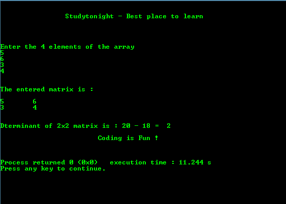

# 2x2 矩阵的判定程序

> 原文：<https://www.studytonight.com/c/programs/array/determinant-of-2x2-matrix>

下面是一个寻找 2x2 矩阵的**行列式**的程序。

请注意，当我们说 2x2 矩阵时，我们指的是 2x2 的数组。

```cpp
#include<stdio.h>

int main()
{
    printf("\n\n\t\tStudytonight - Best place to learn\n\n\n");

    int a[2][2], i, j;
    long determinant;

    printf("\n\nEnter the 4 elements of the array\n");
    for(i = 0; i < 2; i++)
    for(j = 0; j < 2; j++)
    scanf("%d", &a[i][j]);

    printf("\n\nThe entered matrix is: \n\n");
    for(i = 0; i < 2; i++)
    {
        for(j = 0; j < 2; j++)
        {
            printf("%d\t", a[i][j]);   // to print the complete row
        }
        printf("\n"); // to move to the next row
    }

    // finding the determinant of a 2x2 matrix
    determinant = a[0][0]*a[1][1] - a[1][0]*a[0][1];
    printf("\n\nDterminant of 2x2 matrix is : %d - %d =  %d", a[0][0]*a[1][1], a[1][0]*a[0][1], determinant);

    printf("\n\n\t\t\tCoding is Fun !\n\n\n");
    return 0;
}
```

### 输出:



* * *

* * *