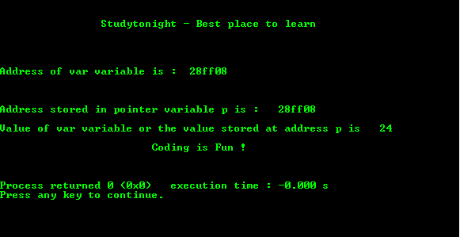

# 指针基本程序

> 原文:[https://www . study south . com/c/programs/pointer/simple-pointer-program](https://www.studytonight.com/c/programs/pointer/simple-pointer-program)

需要记住的几个要点:

*   `*`用于访问指针变量中存储的值。
*   `&`用于存储给定变量的地址。

这里是 C 语言教程关于 C 中的指针→[C 中的指针](/c/pointers-in-c.php)

下面是一个简单的指针程序。

`int *p;`是指针变量声明，其中`p`是指向`int`变量的指针，即它存储整数的位置。

`%x`是打印十六进制值的格式说明符。它通常用于打印位置。

```cpp
#include <stdio.h>

int main()
{
    printf("\n\n\t\tStudytonight - Best place to learn\n\n\n");
    int var = 24;   // actual variable declaration
    int *p;

    p = &var;   // storing address of int variable var in pointer p

    printf("\n\nAddress of var variable is: %x \n\n", &var);

    // address stored in pointer variable
    printf("\n\nAddress stored in pointer variable p is: %x", p);

    // access the value using the pointer variable
    printf("\n\nValue of var variable or the value stored at address p is   %d ", *p);

    printf("\n\n\t\t\tCoding is Fun !\n\n\n");
    return 0;
}
```

### 输出:



* * *

* * *