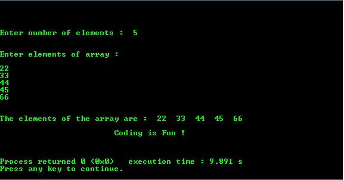

# 将`malloc()`用于动态内存分配的程序

> 原文：<https://www.studytonight.com/c/programs/pointer/memory-management-program>

下面是一个使用`malloc()`动态分配内存和使用`free()`清空内存空间的程序。

`sizeof()`返回任何数据类型占用的字节数，在本例中是一个整数。

```cpp
#include <stdio.h>

int main()
{
    printf("\n\n\t\tStudytonight - Best place to learn\n\n\n");
    int n, i, *ptr, sum = 0;

    printf("\n\nEnter number of elements: ");
    scanf("%d", &n);

    // dynamic memory allocation using malloc()
    ptr = (int *) malloc(n*sizeof(int));

    if(ptr == NULL) // if empty array
    {
        printf("\n\nError! Memory not allocated\n");
        return 0;   // end of program
    }

    printf("\n\nEnter elements of array: \n\n");
    for(i = 0; i < n; i++)
    {
        // storing elements at contiguous memory locations
        scanf("%d", ptr+i);    
        sum = sum + *(ptr + i);
    }

    // printing the array elements using pointer to the location
    printf("\n\nThe elements of the array are: ");
    for(i = 0; i < n; i++)
    {
        printf("%d  ",ptr[i]);    // ptr[i] is same as *(ptr + i)
    }

    /* 
        freeing memory of ptr allocated by malloc 
        using the free() method
    */
    free(ptr);

    printf("\n\n\t\t\tCoding is Fun !\n\n\n");
    return 0;
}
```

### 输出:



* * *

* * *