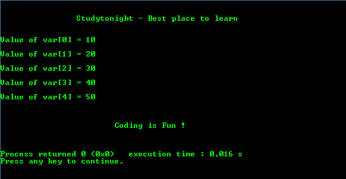

# C 程序：访问整型指针数组

> 原文：<https://www.studytonight.com/c/programs/pointer/array-of-pointers>

下面是一个访问`int`指针数组的程序:

```cpp
#include <stdio.h>
/* 
    Global declaration. 
    Value of a const variable cannot be changed 
    throughout the execution of program
*/
const int MAX = 5;  

int main()
{

    printf("\n\n\t\tStudytonight - Best place to learn\n\n\n");

    int var[]={10, 20, 30, 40, 50}; // initializing an array(here var) of int pointers
    int i = 0;

    /*
        ptr is an array of int pointers i.e. 
        it stores the address of each array element
    */
    int *ptr[MAX];

    for(i = 0; i < MAX; i++)
    {
        /*
            Assign the address of each of the array 
            element to the ptr array
        */
        ptr[i] = &var[i];
    }

    for(i = 0; i < MAX; i++)
    {
        /*
            ptr[i] stores the address of the element var[i]. 
            Hence, *ptr[i] returns the value of the element 
            stored at location ptr[i]
        */
        printf("Value of var[%d] = %i\n\n", i, *ptr[i]);
    }

    printf("\n\n\t\t\tCoding is Fun !\n\n\n");
    return 0;
}
```

### 输出:



### 解释:

```cpp
printf("Value of var[%d] = %i\n\n", i, *ptr[i]);
```

*   这里`ptr[i]`存储元素`var[i]`的地址。因此，`*ptr[i]`返回存储在位置`var[i]`的元素的值。

* * *

## 访问`char`指针数组的程序

`char`指针数组仅使用每个字符串的第一个字符(基址)的地址来访问完整的字符串。

下面是一个访问`char`指针数组的程序。

```cpp
#include <stdio.h>
const int MAX = 4;  // Global declaration.

int main()
{

	printf("\n\n\t\tStudytonight - Best place to learn\n\n\n");

    char *names[] = {"Google", "Amazon", "Facebook", "Apple"}; // initializing an array(here names) of char pointers
    int i = 0;

    for(i = 0; i < MAX; i++)
    {
        printf("Value of names[%d] = %s\n\n", i, names[i]);
    }

    printf("\n\n\t\t\tCoding is Fun !\n\n\n");
    return 0;
}
```

### 输出:


### 解释:

```cpp
printf("Value of names[%d] = %s\n\n",i,names[i]);
```

*   该语句用于仅使用指向`names`数组每个元素的第一个字符的指针来打印完整的名称。

* * *