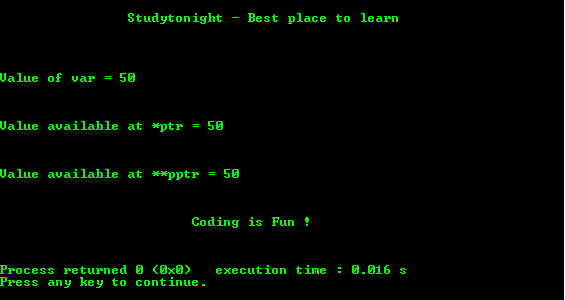

# 指向指针的基本 C 程序

> 原文：<https://www.studytonight.com/c/programs/pointer/pointer-to-a-pointer>

指针变量存储值的地址。类似地，指向指针的指针存储指针变量的地址。利用`**`执行指向指针的指针。

下面是一个指向指针的程序。

`int var;`是存储值的整数变量。

`int *ptr;`是存储整数变量地址的指针变量。

`int **pptr;`是指向指针变量的指针，该指针变量存储指针变量的地址。

```cpp
#include<stdio.h>

int main()
{
    printf("\n\n\t\tStudytonight - Best place to learn\n\n\n");
    int var;
    int *ptr;
    int **pptr;

    var = 50;

    // take the address of the variable var
    ptr = &var;

    // taking the address of ptr using address of operator-&
    pptr = &ptr;

    // take the value using the pptr
    printf("\n\nValue of var = %d\n\n", var);

    printf("\n\nValue available at *ptr = %d\n\n", *ptr);

    printf("\n\nValue available at **pptr = %d\n\n", **pptr);

    printf("\n\n\t\t\tCoding is Fun !\n\n\n");
    return 0;
}
```

### 输出:



* * *

* * *