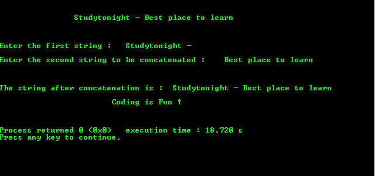

# C 程序：使用指针连接字符串

> 原文：<https://www.studytonight.com/c/programs/pointer/concatenate-strings-using-pointer>

下面是一个使用指针连接字符串的程序:

```cpp
#include <stdio.h>

int main()
{
    printf("\n\n\t\tStudytonight - Best place to learn\n\n\n");
    char aa[100], bb[100];

    printf("\nEnter the first string: ");
    gets(aa);   // inputting first string

    printf("\nEnter the second string to be concatenated: ");
    gets(bb);   // inputting second string

    char *a = aa;
    char *b = bb;

    // pointing to the end of the 1st string
    while(*a)   // till it doesn't point to NULL-till string is not empty
    {
        a++;    // point to the next letter of the string
    }
    while(*b)   // till second string is not empty
    {
        *a = *b;
        b++;
        a++;
    }
    *a = '\0';  // string must end with '\0'
    printf("\n\n\nThe string after concatenation is: %s ", aa);
    printf("\n\n\t\t\tCoding is Fun !\n\n\n");
    return 0;
}
```

### 输出:



### 解释:

*   在`char *a = aa;`中，`a`是指向**字符**数组的指针，并存储`aa`的基址。
*   在`char *b = bb;`中，`b`是指向**字符**数组的指针，并存储`bb`的基址。
*   `*a = *b;`在第一个的末尾存储第二个的基址。

* * *

* * *