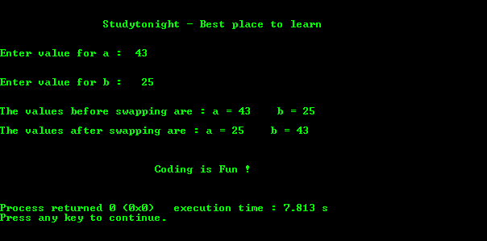

# 使用指针交换两个数字的 C 程序

> 原文：<https://www.studytonight.com/c/programs/pointer/swapping-two-numbers-using-pointers>

下面是一个用指针交换两个数字的程序。

```cpp
#include<stdio.h>

int main()
{
    printf("\n\n\t\tStudytonight - Best place to learn\n\n\n");

    int a, b;
    int *ptra, *ptrb;
    int temp;

    printf("Enter value for a: ");
    scanf("%d", &a);

    printf("\n\nEnter value for b: ");
    scanf("%d", &b);

    printf("\n\nThe values before swapping are: a = %d     b = %d", a, b);

    ptra = &a;    // to store the location of a
    ptrb = &b;    // to store the location of b

    temp = *ptra;   // temp stores the value at location ptra
    *ptra = *ptrb;  // assigning value at location  ptrb to ptra
    *ptrb = temp;   // assign value of themp to  the variable at location ptrb

    printf("\n\nThe values after swapping are: a = %d    b = %d", a, b);

    printf("\n\n\n\n\t\t\tCoding is Fun !\n\n\n");
    return 0;

}
```

### 输出:



* * *

* * *