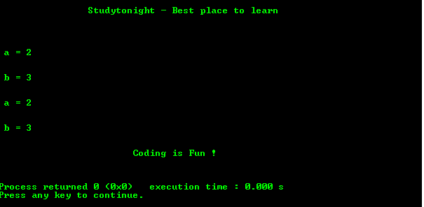

# 指向函数的指针的 C 程序

> 原文：<https://www.studytonight.com/c/programs/pointer/pointer-to-a-function>

下面是一个指向函数的程序。

下面是 C 语言教程，解释带有函数的指针→ [指向函数的指针](/c/pointer-with-function-in-c.php)

```cpp
#include<stdio.h>

int func(int a, int b)  // function definition
{
    printf("\n\n a = %d \n", a);
    printf("\n\n b = %d \n", b);
}

int main()
{
    printf("\n\n\t\tStudytonight - Best place to learn\n\n\n");

    // function pointer
    int(*fptr)(int , int);

    // assign address to function pointer
    fptr = func;

    // function calling
    func(2,3);
    fptr(2,3);  // calling a function referring to pointer to a function

    printf("\n\n\t\t\tCoding is Fun !\n\n\n");
    return 0;
}
```

### 输出:



* * *

* * *