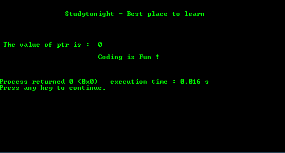

# 空指针程序

> 原文:[https://www . study south . com/c/programs/pointer/null-pointer-program](https://www.studytonight.com/c/programs/pointer/null-pointer-program)

空指针是指针的特殊保留值。任何类型的指针都有这个保留值。形式上，每个特定的指针类型 **(int *、char *、等等)**都有自己专用的空指针值。从概念上讲，当指针有空值时，它并不指向任何地方。

Void 指针是一种特定的指针类型。`void *`它是指向存储器中某个数据位置的指针，没有任何特定的类型。

**空指针**是一个值，而**空指针**是一个类型。

下面是一个空指针的程序。

```cpp
#include<stdio.h>

int main()
{
    printf("\n\n\t\tStudytonight - Best place to learn\n\n\n");
    int *ptr = NULL;    // ptr is a NULL pointer

    printf("\n\n The value of ptr is: %x ", ptr);
    printf("\n\n\t\t\tCoding is Fun !\n\n\n");
    return 0;
}
```

### 输出:



* * *

* * *