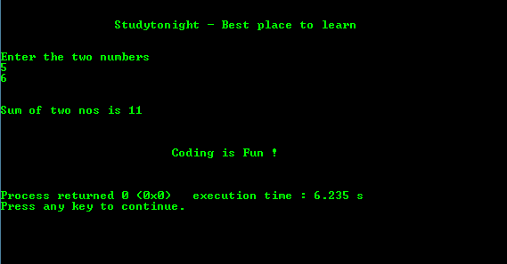

# 递归相加两个数的 C 程序

> 原文：<https://www.studytonight.com/c/programs/recursion/adding-two-numbers-using-recursion>

下面是一个用递归将两个数相加的程序。

```cpp
#include<stdio.h>

int y;

/*
    Function to add two numbers and
    return the result
*/
int add(int m, int n)
{
    if(n == 0)
        return m;

    /*
        Recursion: adding 1, n times and 
        then at the end adding m to it
    */
    y = add(m, n-1) + 1;
    return y;   // return the result
}

int main()
{
    printf("\n\n\t\tStudytonight - Best place to learn\n\n\n");
    int a, b, r;
    printf("Enter the two numbers:\n");
    scanf("%d%d", &a, &b);
    r = add(a, b);     // function call
    printf("\n\nSum of two numbers is: %d\n\n", r);
    printf("\n\n\t\t\tCoding is Fun !\n\n\n");
    return 0;
}
```

### 输出:



* * *

* * *