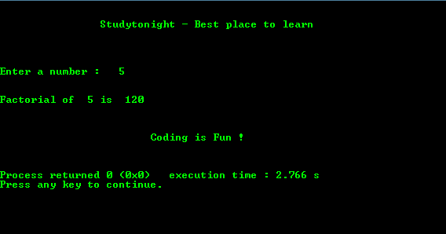

# 用递归求一个数的阶乘的程序

> 原文:[https://www . study south . com/c/programs/递归/阶乘-使用-递归](https://www.studytonight.com/c/programs/recursion/factorial-using-recursion)

下面是一个用递归求给定数的阶乘的程序。

```cpp
#include<stdio.h>
// declaring the function
int fact(int);

int main()
{
    printf("\n\n\t\tStudytonight - Best place to learn\n\n\n");
    int num, f;
    printf("\n\nEnter a number: ");
    scanf("%d", &num);
    f= fact(num);
    printf("\n\nFactorial of  %d is  %d\n\n", num, f);
    printf("\n\n\t\t\tCoding is Fun !\n\n\n");
    return 0;
}

int fact(int aj)
{
    if(aj==1 || aj==0)
        return 1;
    else
        return (aj*fact(aj-1));
}
```

### 输出:



* * *

* * *