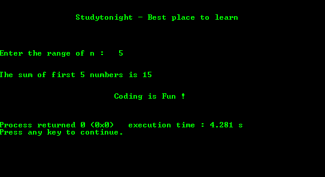

# 寻找前 N 个数和的程序

> 原文：<https://www.studytonight.com/c/programs/recursion/sum-of-first-n-numbers>

下面是一个用递归求前`n`数之和的程序，其中`n`的值由用户提供。

```cpp
#include<stdio.h>
// declaring the recursive function
int getSum(int);

int main()
{
    printf("\n\n\t\tStudytonight - Best place to learn\n\n\n");
    int n, sum;
    printf("\n\nEnter the range of n: ");
    scanf("%d", &n);
    sum = getSum(n);
    printf("\n\nThe sum of first %d numbers is %d\n", n, sum);
    printf("\n\n\t\t\tCoding is Fun !\n\n\n");
    return 0;
}

// function definition
int getSum(int aj)
{
    /*
        static variables hold their values
        till the end of the program
    */
    static int sum = 0;
    if(aj > 0)
    {
        sum = sum + aj;
        getSum(aj-1);
    }
    return sum ;
}
```

### 输出:



* * *

* * *