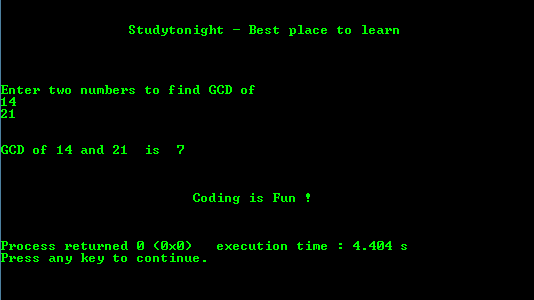

# 用递归求两个数的 GCD 的 c 程序

> 原文:[https://www . study south . com/c/programs/recursion/gcd-of-two-numbers-use-recursion](https://www.studytonight.com/c/programs/recursion/gcd-of-two-numbers-using-recursion)

**两个数的最大公约数(GCD)** 是两个数相除的数。

下面是一个程序，以 GCD 的两个用户输入数字使用递归。

```cpp
#include<stdio.h>

// declaring the recursive function
int find_gcd(int , int );

int main()
{
    printf("\n\n\t\tStudytonight - Best place to learn\n\n\n");
    int a, b, gcd;
    printf("\n\nEnter two numbers to find GCD of \n");
    scanf("%d%d", &a, &b);
    gcd = find_gcd(a, b);
    printf("\n\nGCD of %d and %d is: %d\n\n", a, b, gcd);
    printf("\n\n\t\t\tCoding is Fun !\n\n\n");
    return 0;
}

// defining the function
int find_gcd(int x, int y)
{
    if(x > y)
        find_gcd(x-y, y);

    else if(y > x)
        find_gcd(x, y-x);
    else
    return x;
}
```

### 输出:



* * *

* * *