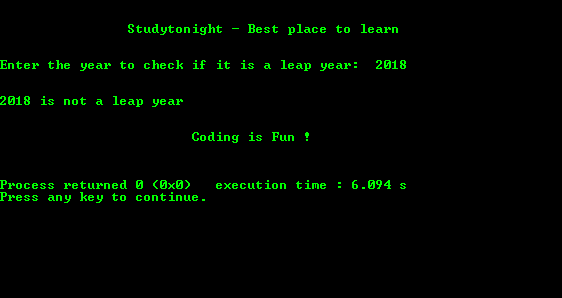

# 识别闰年的程序

> 原文：<https://www.studytonight.com/c/programs/important-concepts/identify-a-leap-year>

下面是识别用户输入的年份是否是闰年的程序。

`%nd`用于对齐文本，表示`n`空格内的值，剩余空格为前导。

```cpp
#include<stdio.h>

int main()
{
    printf("\n\n\t\tStudytonight - Best place to learn\n\n\n");

    int year;

    printf("Enter the year to check if it is a leap year: ");
    scanf("%d", &year);

    // divisible by 4, 100 and 400
    if(year%400 == 0)
        printf("\n\n%d is a leap year\n", year);

    // divisible by 100 and 4 and not divisible by 400
    else if(year%100 == 0)
        printf("\n\n%d is not a leap year\n", year);

    // divisible only by 4 and not by 100
    else if(year%4 == 0)
    {   
        /*
            %0nd is used to represent the number 
            in n digits with leading 0's
        */
        printf("\n\n%07d is a leap year\n", year); 
    }
    // not divisible by 4
    else
        printf("\n\n%d is not a leap year\n", year);

    printf("\n\n\t\t\tCoding is Fun !\n\n\n");
    return 0;
}
```

### 输出:



* * *

* * *